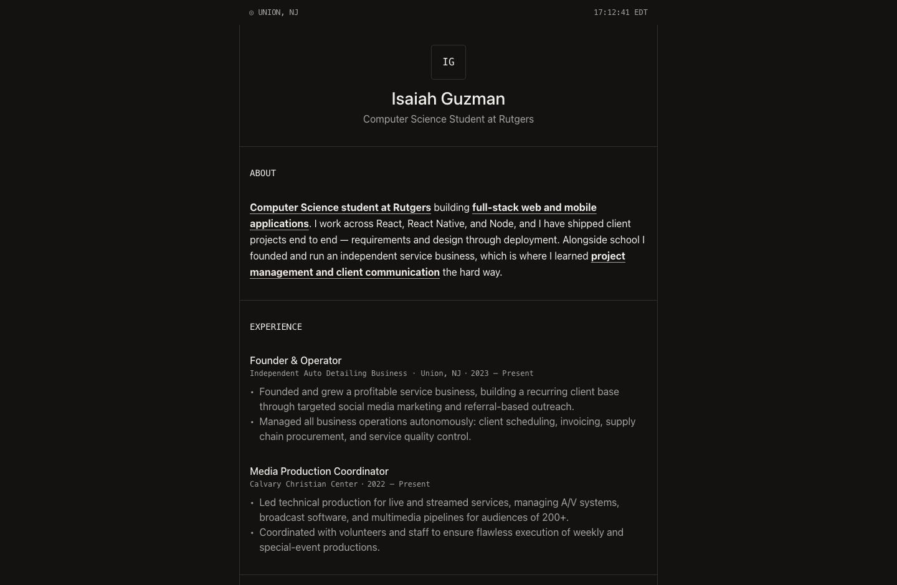

# Isaiah Guzman — Portfolio

Personal portfolio site built with Next.js (App Router), TypeScript, and Tailwind CSS v4.



## Stack

| | |
| --- | --- |
| Framework | [Next.js 16](https://nextjs.org) (App Router, Turbopack) |
| Language | TypeScript 5 |
| UI | React 19 |
| Styling | Tailwind CSS v4 (theme variables in `globals.css`) |
| Icons | [simple-icons](https://simpleicons.org) |
| Rendering | Fully static — prerendered at build time |

## Development

```bash
npm run dev
```

Open http://localhost:3000.

## Editing content

All resume content lives in [`src/lib/resume.ts`](src/lib/resume.ts) — profile, about, experience,
projects, education, certifications, skills, and domains. Edit that file to update the site; the
page reads from it directly, so no component changes are needed to add or reorder entries.

Skill icons are referenced by [simple-icons](https://simpleicons.org) slug. To add one, append the
slug to `skills` in `resume.ts` and add the matching import to
[`src/components/TechIcon.tsx`](src/components/TechIcon.tsx).

## Design system

The visual system (colors, typography, 4px spacing grid, component patterns) was extracted with
`skillui` and lives in [`dnh2703-design/`](dnh2703-design). Tokens are declared as Tailwind theme
variables in [`src/app/globals.css`](src/app/globals.css).

## Build

```bash
npm run build
```

The site prerenders as fully static content.
