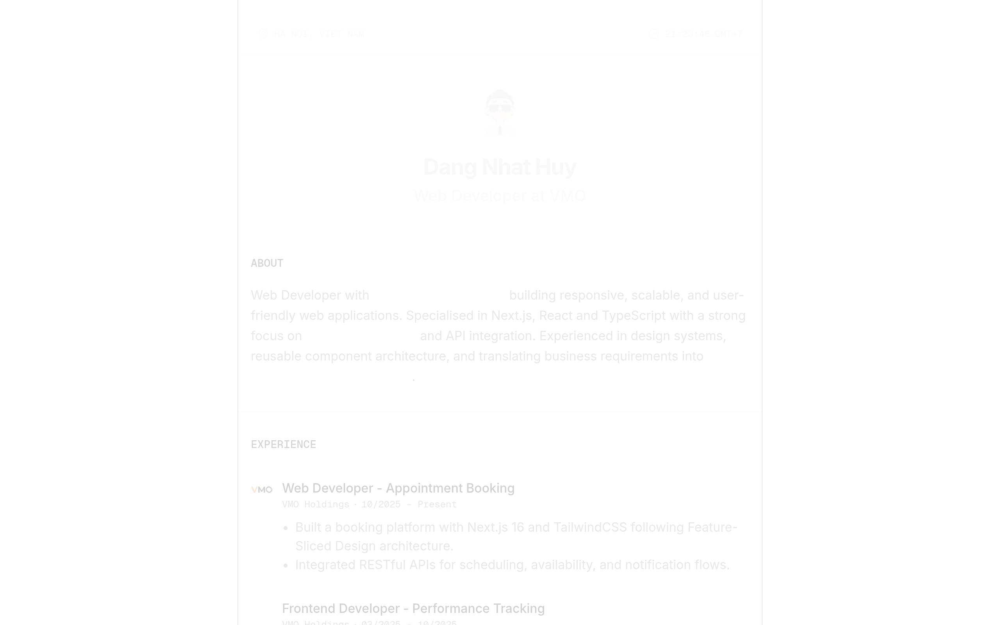
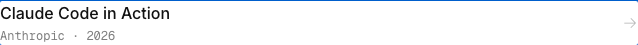
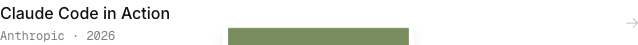
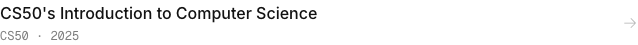
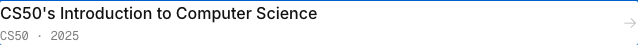
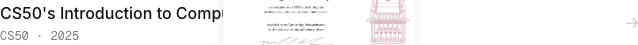
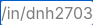
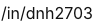

# dnh2703 Design System

You are building UI for **dnh2703**. Light-themed, neutral palette, sans-serif typography (Inter), compact density on a 4px grid.

## Visual Reference

**IMPORTANT**: Study ALL screenshots below before writing any UI. Match colors, typography, spacing, layout, and motion exactly as shown.

### Homepage



### Scroll Journey (Cinematic Visual States)

> These screenshots capture the website at different scroll depths. The design changes dramatically as you scroll — each frame shows a different cinematic state. Replicate these exact visual transitions.

#### 0% — Hero / Above the fold


#### 17% — Mid-page at 17% scroll


#### 33% — Mid-page at 33% scroll


#### 50% — Mid-page at 50% scroll


#### 67% — Mid-page at 67% scroll


#### 83% — Mid-page at 83% scroll


#### 100% — Footer / End of page


> Read `references/DESIGN.md` for full token details. Read `references/ANIMATIONS.md` for motion specs. Read `references/LAYOUT.md` for layout structure. Read `references/COMPONENTS.md` for component patterns.

## Ultra Reference Files

This package includes extended documentation. **Read these files before implementing:**

| File | Contents |
|------|----------|
| `references/DESIGN.md` | Full design system tokens, colors, typography, spacing |
| `references/VISUAL_GUIDE.md` | **START HERE** — Master visual guide with all screenshots embedded |
| `references/ANIMATIONS.md` | CSS keyframes, scroll triggers, motion library stack, video specs |
| `references/LAYOUT.md` | Flex/grid containers, page structure, spacing relationships |
| `references/COMPONENTS.md` | DOM component patterns, HTML structure, class fingerprints |
| `references/INTERACTIONS.md` | Hover/focus states with before/after style diffs |
| `screens/scroll/` | 7 scroll journey screenshots showing cinematic states |

## Design Philosophy

- **Layered depth** — use shadow tokens to create a sense of physical layering. Each elevation level has a specific shadow.
- **Solid colors only** — no gradients anywhere. Every surface is a single flat color.
- **Single typeface** — Inter carries all text. Hierarchy comes from size, weight, and color — never font mixing.
- **compact density** — 4px base grid. Every dimension is a multiple of 4.
- **neutral palette** — the color temperature runs neutral, matching the sans-serif typography.
- **Subtle motion** — transitions smooth state changes. Keep durations under 300ms, use ease-out curves.

## Color System

### Core Palette

| Role | Token | Hex | Use |
|------|-------|-----|-----|
| Background | `--background` | `#ffffff` | Page/app background |
| Surface | `--surface` | `#f0f0f0` | Cards, panels, modals |
| Text Primary | `--text-primary` | `#121212` | Headings, body text |
| Text Muted | `--text-muted` | `#7e7e7e` | Captions, placeholders |

### Extended Palette

- **color-black:** `#000000` — Deep background layer or shadow color
- **color-ink-ghost:** `#b0b0b0`
- **color-chip-border:** `#e3e1e1` — Light surface or highlight color

### CSS Variable Tokens

```css
--color-chip-border: var(--color-chip-border);
--color-chip-border: #e3e1e1;
```

## Typography

### Font Stack

- **Inter** — Heading 1, Heading 2, Heading 3, Body, Caption
- **Geist Mono** — Code

### Font Sources

```css
@font-face {
  font-family: "Inter";
  src: url("fonts/Inter-Bold.ttf") format("truetype");
  font-weight: 700;
}
@font-face {
  font-family: "Inter";
  src: url("fonts/Inter-Regular.ttf") format("truetype");
  font-weight: 400;
}
@font-face {
  font-family: "Geist Mono";
  src: url("fonts/GeistMono-Bold.ttf") format("truetype");
  font-weight: 700;
}
@font-face {
  font-family: "Geist Mono";
  src: url("fonts/GeistMono-Regular.ttf") format("truetype");
  font-weight: 400;
}
```

### Type Scale

| Role | Family | Size | Weight |
|------|--------|------|--------|
| Heading 1 | Inter | 1.75rem | 700 |
| Heading 2 | Inter | inherit | 700 |
| Heading 3 | Inter | 1em | 700 |
| Body | Inter | 80% | 400 |
| Caption | Inter | 75% | 400 |
| Code | Geist Mono | 14px | 400 |

### Typography Rules

- All text uses **Inter** — never add another font family
- Max 3-4 font sizes per screen
- Headings: weight 600-700, body: weight 400
- Use color and opacity for text hierarchy, not additional font sizes
- Line height: 1.5 for body, 1.2 for headings

## Spacing & Layout

### Base Grid: 4px

Every dimension (margin, padding, gap, width, height) must be a multiple of **4px**.

### Spacing Scale

`2, 4, 6, 8, 12, 16, 24, 32, 40` px

### Spacing as Meaning

| Spacing | Use |
|---------|-----|
| 4-8px | Tight: related items (icon + label, avatar + name) |
| 12-16px | Medium: between groups within a section |
| 24-32px | Wide: between distinct sections |
| 48px+ | Vast: major page section breaks |

### Border Radius

Scale: `.25rem, 4px, 6px, 12px`
Default: `6px`

## Component Patterns

### Card

```css
.card {
  background: #f0f0f0;
  border-radius: 6px;
  padding: 16px;
  box-shadow: rgba(0, 0, 0, 0) 0px 0px 0px 0px, rgba(0, 0, 0, 0) 0px 0px 0px 0px, rgba(0, 0, 0, 0) 0px 0px 0px 0px, rgba(0, 0, 0, 0) 0px 0px 0px 0px, rgba(0, 0, 0, 0.1) 0px 10px 15px -3px, rgba(0, 0, 0, 0.1) 0px 4px 6px -4px;
}
```

```html
<div class="card">
  <h3>Card Title</h3>
  <p>Card content goes here.</p>
</div>
```

### Button

```css
/* Primary */
.btn-primary {
  background: #cccccc;
  color: #121212;
  border-radius: 6px;
  padding: 8px 16px;
  font-weight: 500;
  transition: opacity 150ms ease;
}
.btn-primary:hover { opacity: 0.9; }

/* Ghost */
.btn-ghost {
  background: transparent;
  border: 1px solid #cccccc;
  color: #121212;
  border-radius: 6px;
  padding: 8px 16px;
}
```

```html
<button class="btn-primary">Get Started</button>
<button class="btn-ghost">Learn More</button>
```

### Input

```css
.input {
  background: #ffffff;
  border: 1px solid #cccccc;
  border-radius: 6px;
  padding: 8px 12px;
  color: #121212;
  font-size: 14px;
}
.input:focus { border-color: var(--accent); outline: none; }
```

```html
<input class="input" type="text" placeholder="Search..." />
```

### Badge / Chip

```css
.badge {
  display: inline-flex;
  align-items: center;
  padding: 4px 8px;
  border-radius: 9999px;
  font-size: 12px;
  font-weight: 500;
  background: #f0f0f0;
  color: #7e7e7e;
}
```

```html
<span class="badge">New</span>
<span class="badge">Beta</span>
```

### Modal / Dialog

```css
.modal-backdrop { background: rgba(0, 0, 0, 0.6); }
.modal {
  background: #f0f0f0;
  border-radius: 12px;
  padding: 24px;
  max-width: 480px;
  width: 90vw;
  box-shadow: rgba(0, 0, 0, 0) 0px 0px 0px 0px, rgba(0, 0, 0, 0) 0px 0px 0px 0px, rgba(0, 0, 0, 0) 0px 0px 0px 0px, rgba(0, 0, 0, 0) 0px 0px 0px 0px, rgba(0, 0, 0, 0.1) 0px 10px 15px -3px, rgba(0, 0, 0, 0.1) 0px 4px 6px -4px;
}
```

```html
<div class="modal-backdrop">
  <div class="modal">
    <h2>Dialog Title</h2>
    <p>Dialog content.</p>
    <button class="btn-primary">Confirm</button>
    <button class="btn-ghost">Cancel</button>
  </div>
</div>
```

### Table

```css
.table { width: 100%; border-collapse: collapse; }
.table th {
  text-align: left;
  padding: 8px 12px;
  font-weight: 500;
  font-size: 12px;
  color: #7e7e7e;
  text-transform: uppercase;
  letter-spacing: 0.05em;
  border-bottom: 1px solid #cccccc;
}
.table td {
  padding: 12px;
  border-bottom: 1px solid #cccccc;
}
```

```html
<table class="table">
  <thead><tr><th>Name</th><th>Status</th><th>Date</th></tr></thead>
  <tbody>
    <tr><td>Item One</td><td>Active</td><td>Jan 1</td></tr>
    <tr><td>Item Two</td><td>Pending</td><td>Jan 2</td></tr>
  </tbody>
</table>
```

### Navigation

```css
.nav {
  display: flex;
  align-items: center;
  gap: 8px;
  padding: 12px 16px;
}
.nav-link {
  color: #7e7e7e;
  padding: 8px 12px;
  border-radius: 6px;
  transition: color 150ms;
}
.nav-link:hover { color: #121212; }
```

```html
<nav class="nav">
  <a href="/" class="nav-link active">Home</a>
  <a href="/about" class="nav-link">About</a>
  <a href="/pricing" class="nav-link">Pricing</a>
  <button class="btn-primary" style="margin-left: auto">Get Started</button>
</nav>
```

### Extracted Components

These components were found in the codebase:

**Footer** (`html`)

## Page Structure

The following page sections were detected:

- **Hero** — Hero section (detected from heading structure)
- **Footer** — Page footer with links and info

When building pages, follow this section order and structure.

## Animation & Motion

This project uses **subtle motion**. Transitions smooth state changes without calling attention.

### Motion Tokens

- **Duration scale:** `.2s`

### Motion Guidelines

- **Duration:** Use values from the duration scale above. Short (.2s) for micro-interactions, long (.2s) for page transitions
- **Easing:** `ease-out` for enters, `ease-in` for exits
- **Direction:** Elements enter from bottom/right, exit to top/left
- **Reduced motion:** Always respect `prefers-reduced-motion` — disable animations when set

## Depth & Elevation

### Shadow Tokens

- Floating (dropdowns, popovers): `rgba(0, 0, 0, 0) 0px 0px 0px 0px, rgba(0, 0, 0, 0) 0px 0px 0px 0px, rgba(0, 0, 0, 0) 0px 0px 0px 0px, rgba(0, 0, 0, 0) 0px 0px 0px 0px, rgba(0, 0, 0, 0.1) 0px 10px 15px -3px, rgba(0, 0, 0, 0.1) 0px 4px 6px -4px`

### Z-Index Scale

`0, 10`

Use these exact values — never invent z-index values.

## Anti-Patterns (Never Do)

- **No gradients** — solid colors only, everywhere
- **No blur effects** — no backdrop-blur, no filter: blur()
- **No zebra striping** — tables and lists use borders for separation
- **No invented colors** — every hex value must come from the palette above
- **No arbitrary spacing** — every dimension is a multiple of 4px
- **No extra fonts** — only Inter and Geist Mono are allowed
- **No arbitrary border-radius** — use the scale: .25rem, 4px, 6px, 12px
- **No opacity for disabled states** — use muted colors instead
- **No pill shapes** — this design doesn't use rounded-full / 9999px radius

## Workflow

1. **Read** `references/DESIGN.md` before writing any UI code
2. **Pick colors** from the Color System section — never invent new ones
3. **Set typography** — Inter, Geist Mono only, using the type scale
4. **Build layout** on the 4px grid — check every margin, padding, gap
5. **Match components** to patterns above before creating new ones
6. **Apply elevation** — use shadow tokens
7. **Validate** — every value traces back to a design token. No magic numbers.

## Brand Spec

- **Favicon:** `/favicon.ico`
- **Site URL:** `https://www.dnh2703.work/`
- **Brand typeface:** Inter

## Quick Reference

```
Background:     #ffffff
Surface:        #f0f0f0
Text:           #121212 / #7e7e7e
Accent:         (not extracted)
Border:         (not extracted)
Font:           Inter
Spacing:        4px grid
Radius:         6px
Components:     6 detected
```

## When to Trigger

Activate this skill when:
- Creating new components, pages, or visual elements for dnh2703
- Writing CSS, Tailwind classes, styled-components, or inline styles
- Building page layouts, templates, or responsive designs
- Reviewing UI code for design consistency
- The user mentions "dnh2703" design, style, UI, or theme
- Generating mockups, wireframes, or visual prototypes

---

# Full Reference Files

> Every output file is embedded below. Claude has full design system context from /skills alone.

## Design System Tokens (DESIGN.md)

# dnh2703 DESIGN.md

> Auto-generated design system — reverse-engineered via static analysis by skillui.
> Frameworks: None detected
> Colors: 7 · Fonts: 2 · Components: 6
> Icon library: not detected · State: not detected
> Primary theme: light · Dark mode toggle: no · Motion: subtle

## Visual Reference

**Match this design exactly** — study colors, fonts, spacing, and component shapes before writing any UI code.


---

## 1. Visual Theme & Atmosphere

This is a **light-themed** interface with a neutral, approachable feel. The light background emphasizes content clarity. Typography uses **Inter** throughout — a clean, modern choice that maintains consistency. Spacing follows a **4px base grid** (compact density), with scale: 2, 4, 6, 8, 12, 16, 24, 32px. Motion is subtle — smooth transitions (150-300ms) ease state changes without drawing attention.

---

## 2. Color Palette & Roles

| Token | Hex | Role | Use |
|---|---|---|---|
| tw-ring-offset-color | `#ffffff` | background | Page background, darkest surface |
| color-raised | `#f0f0f0` | surface | Card and panel backgrounds |
| color-ink | `#121212` | text-primary | Headings and body text |
| color-ink-dim | `#7e7e7e` | text-muted | Captions, placeholders, secondary info |
| color-black | `#000000` | unknown | Palette color |
| color-ink-ghost | `#b0b0b0` | unknown | Palette color |
| color-chip-border | `#e3e1e1` | unknown | Palette color |

### CSS Variable Tokens

```css
--tw-border-style: solid;
--color-chip-border: var(--color-chip-border);
--color-chip-border: #e3e1e1;
```


---

## 3. Typography Rules

**Font Stack:**
- **Inter** — Heading 1, Heading 2, Heading 3, Body, Caption
- **Geist Mono** — Code

**Font Sources:**

```css
@font-face {
  font-family: "Inter";
  src: url("https://www.dnh2703.work/_next/static/media/2c55a0e60120577a-s.0bjc5tiuqdqro.woff2") format("woff2");
  font-weight: 100;
}
@font-face {
  font-family: "Geist Mono";
  src: url("https://www.dnh2703.work/_next/static/media/4fa387ec64143e14-s.0q3udbd2bu5yp.woff2") format("woff2");
  font-weight: 100;
}
```

| Role | Font | Size | Weight |
|---|---|---|---|
| Heading 1 | Inter | 1.75rem | 700 |
| Heading 2 | Inter | inherit | 700 |
| Heading 3 | Inter | 1em | 700 |
| Body | Inter | 80% | 400 |
| Caption | Inter | 75% | 400 |
| Code | Geist Mono | 14px | 400 |

**Typographic Rules:**
- Use **Inter** for all text — do not mix font families
- Maintain consistent hierarchy: no more than 3-4 font sizes per screen
- Headings use bold (600-700), body uses regular (400)
- Line height: 1.5 for body text, 1.2 for headings
- Use color and opacity for secondary hierarchy, not additional font sizes


---

## 4. Component Stylings

### Layout (1)

**Footer** — `html`

### Navigation (1)

**Navigation** — `html`

### Data Display (1)

**Badge** — `html`

### Media (3)

**Image** — `html`

**Icon** — `html`

**Map/Canvas** — `html`


---

## 5. Layout Principles

- **Base spacing unit:** 4px
- **Spacing scale:** 2, 4, 6, 8, 12, 16, 24, 32, 40
- **Border radius:** .25rem, 4px, 6px, 12px

**Spacing as Meaning:**
| Spacing | Use |
|---|---|
| 4-8px | Tight: related items within a group |
| 12-16px | Medium: between groups |
| 24-32px | Wide: between sections |
| 48px+ | Vast: major section breaks |


---

## 6. Depth & Elevation

### Floating — dropdowns, popovers, modals

- `rgba(0, 0, 0, 0) 0px 0px 0px 0px, rgba(0, 0, 0, 0) 0px 0px 0px 0px, rgba(0, 0, 0, 0) 0px 0px 0px 0px, rgba(0, 0, 0, 0) 0px 0px 0px 0px, rgba(0, 0, 0, 0.1) 0px 10px 15px -3px, rgba(0, 0, 0, 0.1) 0px 4px 6px -4px`

### Z-Index Scale

`0, 10`


---

## 7. Animation & Motion

This project uses **subtle motion**. Transitions smooth state changes without demanding attention.

### Motion Guidelines

- Duration: 150-300ms for micro-interactions, 300-500ms for page transitions
- Easing: `ease-out` for enters, `ease-in` for exits
- Always respect `prefers-reduced-motion`


---

## 8. Do's and Don'ts

### Do's

- Use `#ffffff` as the primary page background
- Use **Inter** for all UI text
- Follow the **4px** spacing grid for all margins, padding, and gaps
- Use the defined shadow tokens for elevation — see Section 6
- Use border-radius from the scale: .25rem, 4px, 6px, 12px
- Reuse existing components from Section 4 before creating new ones

### Don'ts

- Don't introduce colors outside this palette — extend the design tokens first
- Don't mix font families — use Inter consistently
- Don't use arbitrary spacing values — stick to multiples of 4px
- Don't create custom box-shadow values outside the system tokens
- Don't use gradients — the design uses solid colors only
- Don't use arbitrary border-radius values — pick from the defined scale
- Don't duplicate component patterns — check Section 4 first
- Don't use backdrop-blur or blur effects

### Anti-Patterns (detected from codebase)

- No gradient backgrounds
- No blur or backdrop-blur effects
- No zebra striping on tables/lists


---

## 9. Responsive Behavior

No breakpoints detected. Consider adding responsive breakpoints to the design system.

---

## 10. Agent Prompt Guide

Use these as starting points when building new UI:

### Build a Card

```
Background: #f0f0f0
Border: 1px solid var(--border)
Radius: 6px
Padding: 16px
Font: Inter
Use shadow tokens from Section 6.
```

### Build a Button

```
Primary: bg var(--accent), text white
Ghost: bg transparent, border var(--border)
Padding: 8px 16px
Radius: 6px
Hover: opacity 0.9 or lighter shade
Focus: ring with var(--accent)
```

### Build a Page Layout

```
Background: #ffffff
Max-width: 1280px, centered
Grid: 4px base
Responsive: mobile-first, breakpoints from Section 9
```

### Build a Stats Card

```
Surface: #f0f0f0
Label: #7e7e7e (muted, 12px, uppercase)
Value: #121212 (primary, 24-32px, bold)
Status: use success/warning/danger from Section 2
```

### Build a Form

```
Input bg: #ffffff
Input border: 1px solid var(--border)
Focus: border-color var(--accent)
Label: #7e7e7e 12px
Spacing: 16px between fields
Radius: 6px
```

### General Component

```
1. Read DESIGN.md Sections 2-6 for tokens
2. Colors: only from palette
3. Font: Inter, type scale from Section 3
4. Spacing: 4px grid
5. Components: match patterns from Section 4
6. Elevation: shadow tokens
```

## Visual Guide — Screenshots (VISUAL_GUIDE.md)

# dnh2703 — Visual Guide

> Master visual reference. Study every screenshot carefully before implementing any UI.
> Match colors, layout, typography, spacing, and motion states exactly.

## Scroll Journey

The page has cinematic scroll animations. Each screenshot below shows the exact visual state at that scroll depth.
**Replicate these transitions precisely** — the design changes dramatically as you scroll.

### Hero — Above the fold

*Scroll position: 0px of 2796px total*


### 17% scroll depth

*Scroll position: 322px of 2796px total*


### 33% scroll depth

*Scroll position: 626px of 2796px total*


### 50% scroll depth

*Scroll position: 948px of 2796px total*


### 67% scroll depth

*Scroll position: 1270px of 2796px total*


### 83% scroll depth

*Scroll position: 1574px of 2796px total*


### Footer — End of page

*Scroll position: 1878px of 2796px total*


## Full Page Screenshots

### Dang Nhat Huy — Developer Portfolio

*URL: `https://www.dnh2703.work/`*


## Animations & Motion (ANIMATIONS.md)

# Animation Reference

> Cinematic motion design extracted from live DOM. Follow these specs exactly to recreate the experience.

## Motion Technology Stack

Pure CSS animations — no external animation libraries detected.

## Scroll Journey

The page is **2,796px** tall. Each frame below shows what the user sees at that scroll depth.

> **Use these screenshots to understand WHAT animates, WHEN it animates, and HOW it moves.**

### 0% — Top / Hero
Scroll position: 0px


### 17% — Opening Section
Scroll position: 322px


### 33% — First Feature Section
Scroll position: 626px


### 50% — Mid-Page
Scroll position: 948px


### 67% — Lower Content
Scroll position: 1,270px


### 83% — Near Footer
Scroll position: 1,574px


### 100% — Bottom / Footer
Scroll position: 1,878px


## Motion Tokens (CSS Variables)

### Duration Tokens

```css
--default-transition-duration: .15s;
```

### Easing Tokens

```css
--ease-default: cubic-bezier(.16, 1, .3, 1);
--ease-spring: cubic-bezier(.34, 1.56, .64, 1);
--default-transition-timing-function: cubic-bezier(.4, 0, .2, 1);
--ease-out: cubic-bezier(0, 0, .2, 1);
```

## How to Recreate This Motion Design

### Step 2 — Scroll-Reveal Pattern

Elements that animate into view follow this pattern:

```css
/* Initial hidden state */
.reveal {
  opacity: 0;
  transform: translateY(40px);
  transition: opacity .15s cubic-bezier(.16, 1, .3, 1),
              transform .15s cubic-bezier(.16, 1, .3, 1);
}
.reveal.visible {
  opacity: 1;
  transform: translateY(0);
}
```

### Step 3 — Key Motion Principles

- **Duration scale:** `.15s` — use these values, never invent new durations
- **Always add** `@media (prefers-reduced-motion: reduce) { * { animation-duration: 0.01ms !important; transition-duration: 0.01ms !important; } }`

### Step 4 — Scroll Journey Reference

Match what happens at each scroll position:

- **0%** (`0px`) → `screens/scroll/scroll-000.png`
- **17%** (`322px`) → `screens/scroll/scroll-017.png`
- **33%** (`626px`) → `screens/scroll/scroll-033.png`
- **50%** (`948px`) → `screens/scroll/scroll-050.png`
- **67%** (`1270px`) → `screens/scroll/scroll-067.png`
- **83%** (`1574px`) → `screens/scroll/scroll-083.png`
- **100%** (`1878px`) → `screens/scroll/scroll-100.png`

## Layout & Grid (LAYOUT.md)

# Layout Reference

> Auto-extracted from live DOM. Use this to understand how the site is structured spatially.

## Spacing System

**Base grid:** 4px

**Scale:** `2, 4, 6, 8, 12, 16, 24, 32, 40` px

| Spacing | Semantic Use |
|---------|-------------|
| 4px | Tight — within a component |
| 8px | Medium — between sibling items |
| 16px | Wide — between sections |
| 32px | Vast — major section breaks |

## Flex Layouts

| Element | Direction | Justify | Align | Gap | Children |
|---------|-----------|---------|-------|-----|----------|
| `footer.py-10.flex` | column | — | center | 12px | 2 |
| `section.px-4.py-8` | column | — | — | 16px | 2 |
| `section.px-4.py-8` | column | — | — | 32px | 2 |
| `section.px-4.py-8` | column | — | — | 32px | 2 |
| `section.px-4.py-8` | column | — | — | 32px | 2 |
| `div.font-display.flex` | row | space-between | center | — | 2 |
| `div.flex.flex-col` | column | — | center | 24px | 2 |
| `div.flex.flex-col` | column | — | — | 32px | 6 |
| `div.flex.flex-col` | column | — | — | 32px | 1 |
| `div.relative.flex` | column | — | — | 24px | 3 |
| `div.px-4.py-8` | column | — | — | 24px | 4 |
| `div.px-4.py-8` | column | — | — | 24px | 2 |
| `div.px-4.py-8` | column | — | — | 24px | 2 |
| `div.flex.flex-col` | column | — | — | 6px | 2 |
| `div.flex.gap-3` | row | — | — | 12px | 2 |

## Structural Containers

### `<main>` (`main.max-w-2xl.mx-auto`)

```
display:          block
max-width:        672px
children:         9
```

### `<header>` 

```
display:          block
children:         4
```

### `<footer>` (`footer.py-10.flex`)

```
display:          flex
flex-direction:   column
justify-content:  —
align-items:      center
gap:              12px
padding:          40px 0px
children:         2
```

### `<section>` (`section.px-4.py-8`)

```
display:          flex
flex-direction:   column
justify-content:  —
align-items:      —
gap:              16px
padding:          32px 16px
children:         2
```

### `<section>` (`section.px-4.py-8`)

```
display:          flex
flex-direction:   column
justify-content:  —
align-items:      —
gap:              32px
padding:          32px 16px
children:         2
```

### `<section>` (`section.px-4.py-8`)

```
display:          flex
flex-direction:   column
justify-content:  —
align-items:      —
gap:              32px
padding:          32px 16px
children:         2
```

### `<section>` (`section.px-4.py-8`)

```
display:          flex
flex-direction:   column
justify-content:  —
align-items:      —
gap:              32px
padding:          32px 16px
children:         2
```

### `<section>` 

```
display:          block
children:         2
```

### `<section>` 

```
display:          block
children:         2
```

### `<section>` 

```
display:          block
children:         2
```

## Layout Rules

- **Container max-width:** `672px` — always center with `margin: auto`
- Primary layout system: **Flexbox**
- Every spacing value must be a multiple of **4px**
- Never use arbitrary margin/padding values outside the spacing scale

## Component Patterns (COMPONENTS.md)

# Component Reference

> Repeated DOM patterns detected by structural analysis. Each component appeared 3+ times.

## Detected Components

| Component | Category | Instances | Key Classes |
|-----------|----------|-----------|-------------|
| **Font Normal** | unknown | 17× | `.font-normal`, `.font-sans`, `.text-base` |
| **Flex** | list-item | 12× | `.flex`, `.gap-2` |
| **Font Display** | unknown | 7× | `.font-display`, `.font-medium`, `.leading-normal` |
| **Font Medium** | unknown | 7× | `.font-medium`, `.font-sans`, `.text-base` |
| **Flex** | unknown | 6× | `.flex`, `.gap-3` |
| **Flex** | unknown | 6× | `.flex`, `.flex-1`, `.flex-col` |
| **Flex** | unknown | 6× | `.flex`, `.flex-col`, `.text-ink-dim` |
| **Align Baseline** | unknown | 3× | `.align-baseline`, `.inline-flex`, `.overflow-hidden` |
| **Left [0.15em]** | unknown | 3× | `.-left-[0.15em]`, `.-right-[0.18em]`, `.absolute` |
| **Mix Blend Difference** | unknown | 3× | `.mix-blend-difference`, `.pl-[0.15em]`, `.pr-[0.18em]` |
| **Flex** | unknown | 3× | `.flex`, `.flex-col`, `.gap-8` |
| **Bg Tint** | card | 3× | `.bg-tint`, `.border`, `.border-chip-border` |
| **Flex** | card | 3× | `.flex`, `.items-center`, `.justify-between` |
| **Font Normal** | unknown | 3× | `.font-normal`, `.font-sans`, `.text-base` |

## Cards

### Bg Tint

**Instances found:** 3

**CSS classes:** `.bg-tint` `.border` `.border-chip-border` `.font-normal` `.inline-flex` `.items-center`

**HTML structure:**

```html
<span class="inline-flex items-center px-3 py-1.5 rounded text-base font-normal bg-tint text-chip-ink border border-chip-border">ERP</span>
```

**Base styles (from design tokens):**

```css
.bg-tint {
  background: #f0f0f0;
  border-radius: 6px;
  padding: 8px;
}```

### Flex

**Instances found:** 3

**CSS classes:** `.flex` `.items-center` `.justify-between`

**HTML structure:**

```html
<div class="flex items-center justify-between"><p class="font-sans text-base font-normal">Email</p><a href="mailto:dnh2703@gmail.com" target="_blank" rel="noopener noreferrer" class="font-sans text-base font-normal text-ink-dim hover:text-ink transition-colors">dnh2703@gmail.com</a></div>
```

**Base styles (from design tokens):**

```css
.flex {
  background: #f0f0f0;
  border-radius: 6px;
  padding: 8px;
}```

## List Items

### Flex

**Instances found:** 12

**CSS classes:** `.flex` `.gap-2`

**HTML structure:**

```html
<li class="flex gap-2"><span class="shrink-0">•</span><p class="font-sans text-base font-normal">Built a booking platform with Next.js 16…</p></li>
```

**Base styles (from design tokens):**

```css
.flex {
  padding: 4px 0;
}```

## Other Components

### Font Normal

**Instances found:** 17

**CSS classes:** `.font-normal` `.font-sans` `.text-base`

**HTML structure:**

```html
<p class="font-sans text-base font-normal">Built a booking platform with Next.js 16 and TailwindCSS following Feature-Sliced Design architecture.</p>
```

**Base styles (from design tokens):**

```css
.font-normal {
  background: #f0f0f0;
  padding: 4px;
}```

### Font Display

**Instances found:** 7

**CSS classes:** `.font-display` `.font-medium` `.leading-normal` `.text-sm` `.tracking-normal` `.uppercase`

**HTML structure:**

```html
<p class="font-display text-sm font-medium tracking-normal leading-normal uppercase">About</p>
```

**Base styles (from design tokens):**

```css
.font-display {
  background: #f0f0f0;
  padding: 4px;
}```

### Font Medium

**Instances found:** 7

**CSS classes:** `.font-medium` `.font-sans` `.text-base` `.text-black`

**HTML structure:**

```html
<h3 class="font-sans text-base text-black font-medium">Web Developer - Appointment Booking</h3>
```

**Base styles (from design tokens):**

```css
.font-medium {
  background: #f0f0f0;
  padding: 4px;
}```

### Flex

**Instances found:** 6

**CSS classes:** `.flex` `.gap-3`

**HTML structure:**

```html
<div class="flex gap-3"><div class="size-7 overflow-hidden shrink-0"></div><div class="flex-1 flex flex-col gap-2"><div><h3 class="font-sans text-base text-black font-medium">Web Developer - Appointment Booking</h3><p class="font-display text-xs font-normal tracking
```

**Base styles (from design tokens):**

```css
.flex {
  background: #f0f0f0;
  padding: 4px;
}```

### Flex

**Instances found:** 6

**CSS classes:** `.flex` `.flex-1` `.flex-col` `.gap-2`

**HTML structure:**

```html
<div class="flex-1 flex flex-col gap-2"><div><h3 class="font-sans text-base text-black font-medium">Web Developer - Appointment Booking</h3><p class="font-display text-xs font-normal tracking-normal leading-normal text-ink-dim flex gap-1">VMO Holdings<span>·</span>10/2025 – Present</p></div><ul class="flex flex-col text-ink-dim"><li class="flex gap-2"><span class="shrink-0">•</span><p class="font-sans text-base font-normal">Built a booking platform with Next.js 16…</p></li><li class="flex gap-2"><span class="shrink-0">•</span><p class="font-sans text-base font-normal">Integrated RESTful APIs f
```

**Base styles (from design tokens):**

```css
.flex {
  background: #f0f0f0;
  padding: 4px;
}```

### Flex

**Instances found:** 6

**CSS classes:** `.flex` `.flex-col` `.text-ink-dim`

**HTML structure:**

```html
<ul class="flex flex-col text-ink-dim"><li class="flex gap-2"><span class="shrink-0">•</span><p class="font-sans text-base font-normal">Built a booking platform with Next.js 16…</p></li><li class="flex gap-2"><span class="shrink-0">•</span><p class="font-sans text-base font-normal">Integrated RESTful APIs for scheduling, …</p></li></ul>
```

**Base styles (from design tokens):**

```css
.flex {
  background: #f0f0f0;
  padding: 4px;
}```

### Align Baseline

**Instances found:** 3

**CSS classes:** `.align-baseline` `.inline-flex` `.overflow-hidden` `.relative`

**HTML structure:**

```html
<span class="relative inline-flex overflow-hidden align-baseline"><span class="absolute inset-0 -left-[0.15em] -right-[0.18em] bg-black z-0" style="transform: none;"></span><span class="relative z-10 mix-blend-difference text-white pl-[0.15em] pr-[0.18em]">3 years of experience</span></span>
```

**Base styles (from design tokens):**

```css
.align-baseline {
  background: #f0f0f0;
  padding: 4px;
}```

### Left [0.15em]

**Instances found:** 3

**CSS classes:** `.-left-[0.15em]` `.-right-[0.18em]` `.absolute` `.bg-black` `.inset-0` `.z-0`

**HTML structure:**

```html
<span class="absolute inset-0 -left-[0.15em] -right-[0.18em] bg-black z-0" style="transform: none;"></span>
```

**Base styles (from design tokens):**

```css
.-left-[0.15em] {
  background: #f0f0f0;
  padding: 4px;
}```

### Mix Blend Difference

**Instances found:** 3

**CSS classes:** `.mix-blend-difference` `.pl-[0.15em]` `.pr-[0.18em]` `.relative` `.text-white` `.z-10`

**HTML structure:**

```html
<span class="relative z-10 mix-blend-difference text-white pl-[0.15em] pr-[0.18em]">3 years of experience</span>
```

**Base styles (from design tokens):**

```css
.mix-blend-difference {
  background: #f0f0f0;
  padding: 4px;
}```

### Flex

**Instances found:** 3

**CSS classes:** `.flex` `.flex-col` `.gap-8` `.px-4` `.py-8`

**HTML structure:**

```html
<section aria-label="Experience" class="px-4 py-8 flex flex-col gap-8"><p class="font-display text-sm font-medium tracking-normal leading-normal uppercase">Experience</p><div class="flex flex-col gap-8"><div class="flex gap-3"><div class="size-7 overflow-hidden shrink-0">dnh2703@gmail.com</a>
```

**Base styles (from design tokens):**

```css
.font-normal {
  background: #f0f0f0;
  padding: 4px;
}```

## Component Rules

- Match class names exactly from the patterns above
- Each component instance must be visually identical to others of its type
- Do not add extra wrappers or change the DOM structure

## Interactions & States (INTERACTIONS.md)

# Interaction Reference

> Micro-interactions extracted from live DOM. Recreate these exactly for authentic feel.

## Coverage

| Component Type | Count | States Captured |
|----------------|-------|----------------|
| Link | 3 | default, hover, focus |

## Transition System

These transition declarations were extracted from interactive elements:

```css
transition: all;
transition: color 0.15s cubic-bezier(0.4, 0, 0.2, 1), background-color 0.15s cubic-bezier(0.4, 0, 0.2, 1), border-color 0.15s cubic-bezier(0.4, 0, 0.2, 1), outline-color 0.15s cubic-bezier(0.4, 0, 0.2, 1), text-decoration-color 0.15s cubic-bezier(0.4, 0, 0.2, 1), fill 0.15s cubic-bezier(0.4, 0, 0.2, 1), stroke 0.15s cubic-bezier(0.4, 0, 0.2, 1), --tw-gradient-from 0.15s cubic-bezier(0.4, 0, 0.2, 1), --tw-gradient-via 0.15s cubic-bezier(0.4, 0, 0.2, 1), --tw-gradient-to 0.15s cubic-bezier(0.4, 0, 0.2, 1);
```

Apply these to all interactive elements. Never invent new durations or easings.

## Link Interactions

### Link 1 — `Claude Code in Action

Anthropic · 2026`

**States:**

- Default: `../screens/states/link-1-default.png`
- Hover: `../screens/states/link-1-hover.png`
- Focus: `../screens/states/link-1-focus.png`

**On focus:**

```css
/* outline: rgb(18, 18, 18) none 3px → */ outline: rgb(0, 95, 204) auto 1px;
/* outline-color: rgb(18, 18, 18) → */ outline-color: rgb(0, 95, 204);
```

**Transition:** `all`

### Link 2 — `CS50's Introduction to Computer Science
`

**States:**

- Default: `../screens/states/link-2-default.png`
- Hover: `../screens/states/link-2-hover.png`
- Focus: `../screens/states/link-2-focus.png`

**On focus:**

```css
/* outline: rgb(18, 18, 18) none 3px → */ outline: rgb(0, 95, 204) auto 1px;
/* outline-color: rgb(18, 18, 18) → */ outline-color: rgb(0, 95, 204);
```

**Transition:** `all`

### Link 3 — `/in/dnh2703`

**States:**

- Default: `../screens/states/link-3-default.png`
- Hover: `../screens/states/link-3-hover.png`
- Focus: `../screens/states/link-3-focus.png`

**On hover:**

```css
/* color: rgb(126, 126, 126) → */ color: rgb(18, 18, 18);
/* border-color: rgb(126, 126, 126) → */ border-color: rgb(18, 18, 18);
/* outline: rgb(126, 126, 126) none 3px → */ outline: rgb(18, 18, 18) none 3px;
/* outline-color: rgb(126, 126, 126) → */ outline-color: rgb(18, 18, 18);
```

**On focus:**

```css
/* outline: rgb(126, 126, 126) none 3px → */ outline: rgb(0, 95, 204) auto 1px;
/* outline-color: rgb(126, 126, 126) → */ outline-color: rgb(0, 95, 204);
```

**Transition:** `color 0.15s cubic-bezier(0.4, 0, 0.2, 1), background-color 0.15s cubic-bezier(0.4, 0, 0.2, 1), border-color 0.15s cubic-bezier(0.4, 0, 0.2, 1), outline-color 0.15s cubic-bezier(0.4, 0, 0.2, 1), text-decoration-color 0.15s cubic-bezier(0.4, 0, 0.2, 1), fill 0.15s cubic-bezier(0.4, 0, 0.2, 1), stroke 0.15s cubic-bezier(0.4, 0, 0.2, 1), --tw-gradient-from 0.15s cubic-bezier(0.4, 0, 0.2, 1), --tw-gradient-via 0.15s cubic-bezier(0.4, 0, 0.2, 1), --tw-gradient-to 0.15s cubic-bezier(0.4, 0, 0.2, 1)`

## Interaction Rules

- Hover effects include **color transitions** — use the extracted values, not approximations
- Focus states use **outline** (not box-shadow) — always match the extracted focus ring
- Transition durations in use: `0.15s`
- Always respect `prefers-reduced-motion` — set all transitions to `0s` when enabled

## Design Tokens — JSON Files

### tokens/colors.json
```json
{
  "$schema": "https://design-tokens.github.io/community-group/format/",
  "core": {
    "text-primary": {
      "value": "#121212",
      "role": "text-primary",
      "name": "color-ink"
    },
    "text-muted": {
      "value": "#7e7e7e",
      "role": "text-muted",
      "name": "color-ink-dim"
    },
    "background": {
      "value": "#ffffff",
      "role": "background",
      "name": "tw-ring-offset-color"
    },
    "surface": {
      "value": "#f0f0f0",
      "role": "surface",
      "name": "color-raised"
    }
  },
  "status": {},
  "extended": {
    "color-black": {
      "value": "#000000",
      "role": "unknown",
      "name": "color-black"
    },
    "color-ink-ghost": {
      "value": "#b0b0b0",
      "role": "unknown",
      "name": "color-ink-ghost"
    },
    "color-chip-border": {
      "value": "#e3e1e1",
      "role": "unknown",
      "name": "color-chip-border"
    }
  },
  "meta": {
    "theme": "light",
    "extracted": "2026-09-11"
  }
}
```

### tokens/spacing.json
```json
{
  "base": {
    "value": "4px",
    "description": "Grid unit — all spacing must be multiples of this"
  },
  "unit": "px",
  "scale": {
    "xs": {
      "value": "2px",
      "px": 2
    },
    "sm": {
      "value": "4px",
      "px": 4
    },
    "md": {
      "value": "6px",
      "px": 6
    },
    "lg": {
      "value": "8px",
      "px": 8
    },
    "xl": {
      "value": "12px",
      "px": 12
    },
    "2xl": {
      "value": "16px",
      "px": 16
    },
    "3xl": {
      "value": "24px",
      "px": 24
    },
    "4xl": {
      "value": "32px",
      "px": 32
    },
    "5xl": {
      "value": "40px",
      "px": 40
    }
  },
  "multipliers": {
    "1x": {
      "value": "4px",
      "raw": 4
    },
    "2x": {
      "value": "8px",
      "raw": 8
    },
    "3x": {
      "value": "12px",
      "raw": 12
    },
    "4x": {
      "value": "16px",
      "raw": 16
    },
    "5x": {
      "value": "20px",
      "raw": 20
    },
    "6x": {
      "value": "24px",
      "raw": 24
    },
    "7x": {
      "value": "28px",
      "raw": 28
    },
    "8x": {
      "value": "32px",
      "raw": 32
    },
    "9x": {
      "value": "36px",
      "raw": 36
    },
    "10x": {
      "value": "40px",
      "raw": 40
    },
    "11x": {
      "value": "44px",
      "raw": 44
    },
    "12x": {
      "value": "48px",
      "raw": 48
    },
    "13x": {
      "value": "52px",
      "raw": 52
    },
    "14x": {
      "value": "56px",
      "raw": 56
    },
    "15x": {
      "value": "60px",
      "raw": 60
    },
    "16x": {
      "value": "64px",
      "raw": 64
    }
  },
  "meta": {
    "totalValues": 9,
    "min": 2,
    "max": 40
  }
}
```

### tokens/typography.json
```json
{
  "families": [
    "Inter",
    "Geist Mono"
  ],
  "scale": {
    "heading-1": {
      "fontFamily": "Inter",
      "fontSize": "1.75rem",
      "fontWeight": "700",
      "lineHeight": null,
      "source": "css"
    },
    "heading-2": {
      "fontFamily": "Inter",
      "fontSize": "inherit",
      "fontWeight": "700",
      "lineHeight": null,
      "source": "css"
    },
    "heading-3": {
      "fontFamily": "Inter",
      "fontSize": "1em",
      "fontWeight": "700",
      "lineHeight": null,
      "source": "css"
    },
    "body": {
      "fontFamily": "Inter",
      "fontSize": "80%",
      "fontWeight": "400",
      "lineHeight": null,
      "source": "css"
    },
    "caption": {
      "fontFamily": "Inter",
      "fontSize": "75%",
      "fontWeight": "400",
      "lineHeight": null,
      "source": "css"
    },
    "code": {
      "fontFamily": "Geist Mono",
      "fontSize": "14px",
      "fontWeight": "400",
      "lineHeight": null,
      "source": "css"
    }
  },
  "fontFaces": [
    {
      "family": "Inter",
      "src": "https://www.dnh2703.work/_next/static/media/2c55a0e60120577a-s.0bjc5tiuqdqro.woff2",
      "format": "woff2",
      "weight": "100"
    },
    {
      "family": "Inter",
      "src": "https://www.dnh2703.work/_next/static/media/9c72aa0f40e4eef8-s.0m6w47a4e5dy9.woff2",
      "format": "woff2",
      "weight": "100"
    },
    {
      "family": "Inter",
      "src": "https://www.dnh2703.work/_next/static/media/ad66f9afd8947f86-s.11u06r12fd6v_.woff2",
      "format": "woff2",
      "weight": "100"
    },
    {
      "family": "Inter",
      "src": "https://www.dnh2703.work/_next/static/media/5476f68d60460930-s.0wxq9webf.ew4.woff2",
      "format": "woff2",
      "weight": "100"
    },
    {
      "family": "Inter",
      "src": "https://www.dnh2703.work/_next/static/media/2bbe8d2671613f1f-s.067x_6k0k23tk.woff2",
      "format": "woff2",
      "weight": "100"
    },
    {
      "family": "Inter",
      "src": "https://www.dnh2703.work/_next/static/media/1bffadaabf893a1e-s.16ipb6fqu393i.woff2",
      "format": "woff2",
      "weight": "100"
    },
    {
      "family": "Inter",
      "src": "https://www.dnh2703.work/_next/static/media/83afe278b6a6bb3c-s.p.0q-301v4kxxnr.woff2",
      "format": "woff2",
      "weight": "100"
    },
    {
      "family": "Geist Mono",
      "src": "https://www.dnh2703.work/_next/static/media/4fa387ec64143e14-s.0q3udbd2bu5yp.woff2",
      "format": "woff2",
      "weight": "100"
    },
    {
      "family": "Geist Mono",
      "src": "https://www.dnh2703.work/_next/static/media/bbc41e54d2fcbd21-s.0gw~uztddq1df.woff2",
      "format": "woff2",
      "weight": "100"
    },
    {
      "family": "Geist Mono",
      "src": "https://www.dnh2703.work/_next/static/media/797e433ab948586e-s.p.0.q-h669a_dqa.woff2",
      "format": "woff2",
      "weight": "100"
    }
  ],
  "rules": {
    "maxSizesPerScreen": 4,
    "headingWeightRange": "600-700",
    "bodyWeight": 400,
    "lineHeightBody": 1.5,
    "lineHeightHeading": 1.2
  }
}
```

## Bundled Fonts (fonts/)

The following font files are bundled in the `fonts/` directory:

- `fonts/GeistMono-Black.ttf`
- `fonts/GeistMono-Bold.ttf`
- `fonts/GeistMono-ExtraBold.ttf`
- `fonts/GeistMono-ExtraLight.ttf`
- `fonts/GeistMono-Light.ttf`
- `fonts/GeistMono-Medium.ttf`
- `fonts/GeistMono-Regular.ttf`
- `fonts/GeistMono-SemiBold.ttf`
- `fonts/GeistMono-Thin.ttf`
- `fonts/Inter-Black.ttf`
- `fonts/Inter-Bold.ttf`
- `fonts/Inter-ExtraBold.ttf`
- `fonts/Inter-ExtraLight.ttf`
- `fonts/Inter-Light.ttf`
- `fonts/Inter-Medium.ttf`
- `fonts/Inter-Regular.ttf`
- `fonts/Inter-SemiBold.ttf`
- `fonts/Inter-Thin.ttf`

Use these local font files in `@font-face` declarations instead of fetching from Google Fonts.

## Screenshots Inventory (screens/)

> Study all screenshots carefully before implementing any UI. Match every visual detail exactly.

### Scroll Journey (screens/scroll/)

*Cinematic scroll states — page visual at each scroll depth*


### Full Page Screenshots (screens/pages/)

*Full-page screenshots of each crawled URL*


### Interaction States (screens/states/)

*Hover, focus, and active state captures*

















### Screenshot Index (screens/INDEX.md)

# Screenshot Index

## Scroll Journey

> Shows the cinematic state at each point of the page

| Scroll | Y Position | File |
|--------|-----------|------|
| 0% | 0px | `screens/scroll/scroll-000.png` |
| 17% | 322px | `screens/scroll/scroll-017.png` |
| 33% | 626px | `screens/scroll/scroll-033.png` |
| 50% | 948px | `screens/scroll/scroll-050.png` |
| 67% | 1270px | `screens/scroll/scroll-067.png` |
| 83% | 1574px | `screens/scroll/scroll-083.png` |
| 100% | 1878px | `screens/scroll/scroll-100.png` |

## Pages

| Page | URL | File |
|------|-----|------|
| Dang Nhat Huy — Developer Portfolio | `https://www.dnh2703.work/` | `screens/pages/home.png` |

## Homepage Screenshots (screenshots/)


