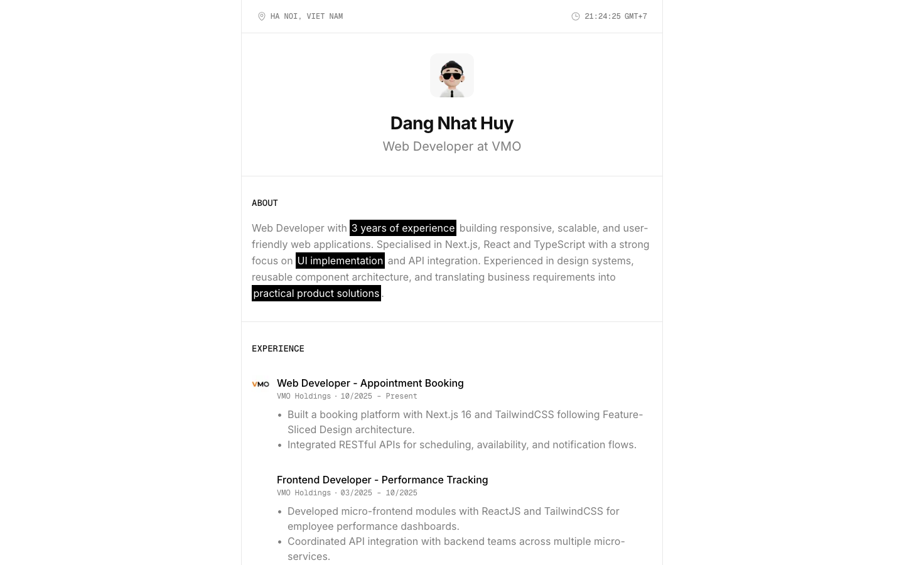
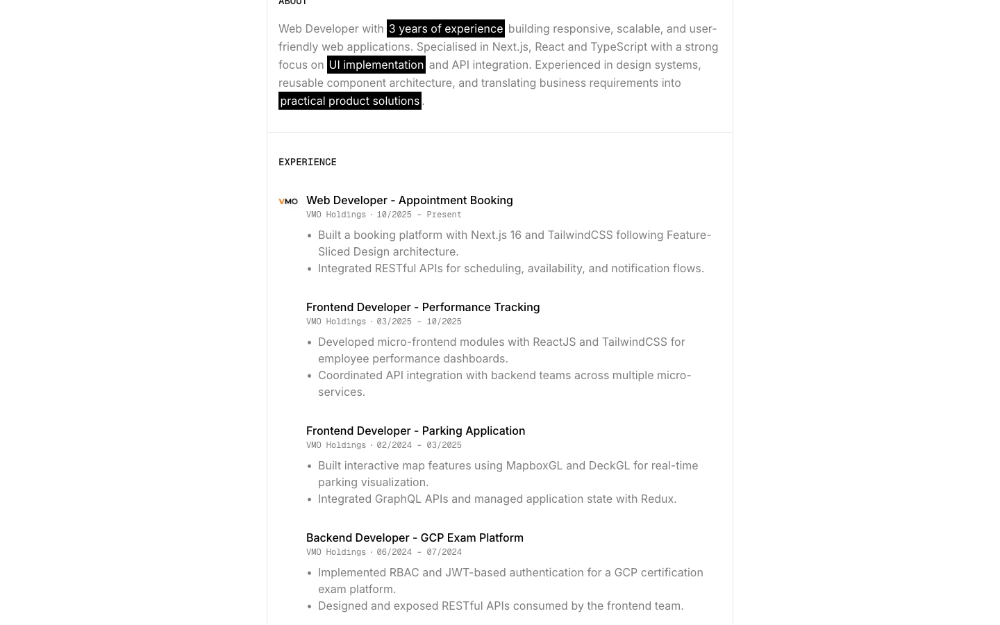
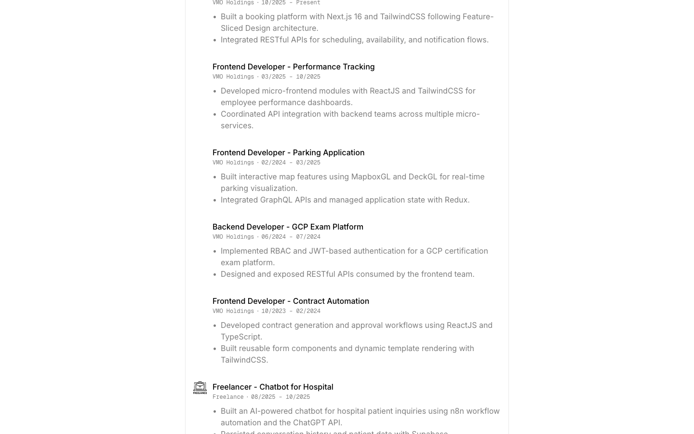
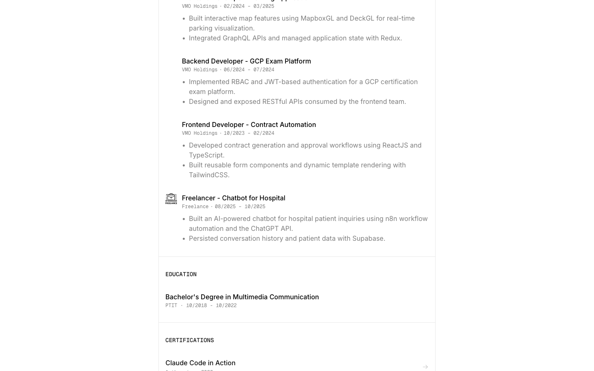
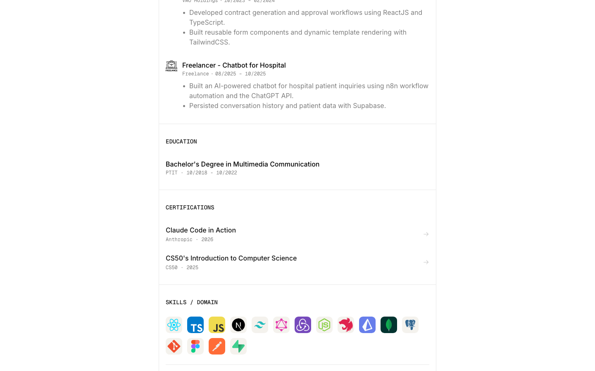
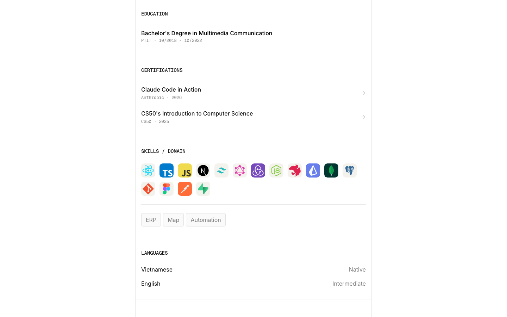
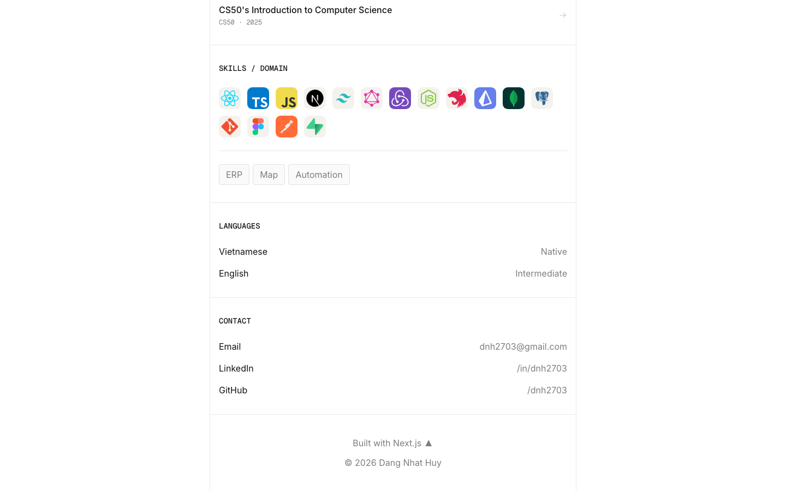

# Animation Reference

> Cinematic motion design extracted from live DOM. Follow these specs exactly to recreate the experience.

## Motion Technology Stack

Pure CSS animations — no external animation libraries detected.

## Scroll Journey

The page is **2,796px** tall. Each frame below shows what the user sees at that scroll depth.

> **Use these screenshots to understand WHAT animates, WHEN it animates, and HOW it moves.**

### 0% — Top / Hero
Scroll position: 0px



### 17% — Opening Section
Scroll position: 322px



### 33% — First Feature Section
Scroll position: 626px



### 50% — Mid-Page
Scroll position: 948px



### 67% — Lower Content
Scroll position: 1,270px



### 83% — Near Footer
Scroll position: 1,574px



### 100% — Bottom / Footer
Scroll position: 1,878px



## Motion Tokens (CSS Variables)

### Duration Tokens

```css
--default-transition-duration: .15s;
```

### Easing Tokens

```css
--ease-default: cubic-bezier(.16, 1, .3, 1);
--ease-spring: cubic-bezier(.34, 1.56, .64, 1);
--default-transition-timing-function: cubic-bezier(.4, 0, .2, 1);
--ease-out: cubic-bezier(0, 0, .2, 1);
```

## How to Recreate This Motion Design

### Step 2 — Scroll-Reveal Pattern

Elements that animate into view follow this pattern:

```css
/* Initial hidden state */
.reveal {
  opacity: 0;
  transform: translateY(40px);
  transition: opacity .15s cubic-bezier(.16, 1, .3, 1),
              transform .15s cubic-bezier(.16, 1, .3, 1);
}
.reveal.visible {
  opacity: 1;
  transform: translateY(0);
}
```

### Step 3 — Key Motion Principles

- **Duration scale:** `.15s` — use these values, never invent new durations
- **Always add** `@media (prefers-reduced-motion: reduce) { * { animation-duration: 0.01ms !important; transition-duration: 0.01ms !important; } }`

### Step 4 — Scroll Journey Reference

Match what happens at each scroll position:

- **0%** (`0px`) → `screens/scroll/scroll-000.png`
- **17%** (`322px`) → `screens/scroll/scroll-017.png`
- **33%** (`626px`) → `screens/scroll/scroll-033.png`
- **50%** (`948px`) → `screens/scroll/scroll-050.png`
- **67%** (`1270px`) → `screens/scroll/scroll-067.png`
- **83%** (`1574px`) → `screens/scroll/scroll-083.png`
- **100%** (`1878px`) → `screens/scroll/scroll-100.png`

