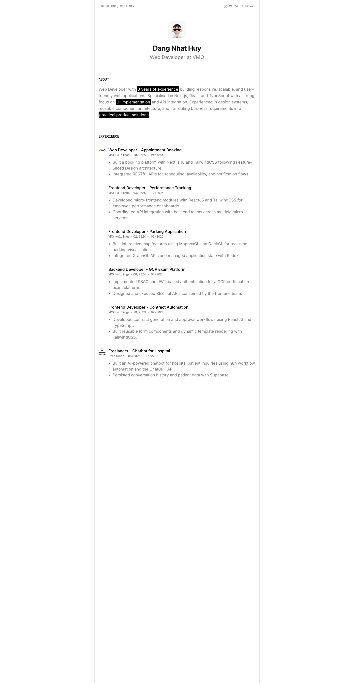

# dnh2703 — Visual Guide

> Master visual reference. Study every screenshot carefully before implementing any UI.
> Match colors, layout, typography, spacing, and motion states exactly.

## Scroll Journey

The page has cinematic scroll animations. Each screenshot below shows the exact visual state at that scroll depth.
**Replicate these transitions precisely** — the design changes dramatically as you scroll.

### Hero — Above the fold

*Scroll position: 0px of 2796px total*

### 17% scroll depth

*Scroll position: 322px of 2796px total*

### 33% scroll depth

*Scroll position: 626px of 2796px total*

### 50% scroll depth

*Scroll position: 948px of 2796px total*

### 67% scroll depth

*Scroll position: 1270px of 2796px total*

### 83% scroll depth

*Scroll position: 1574px of 2796px total*

### Footer — End of page

*Scroll position: 1878px of 2796px total*

## Full Page Screenshots

### Dang Nhat Huy — Developer Portfolio

*URL: `https://www.dnh2703.work/`*

