# johnnychai Design System

You are building UI for **johnnychai**. Light-themed, neutral palette, sans-serif typography (Geist), compact density on a 4px grid.

## Visual Reference

**IMPORTANT**: Study ALL screenshots below before writing any UI. Match colors, typography, spacing, layout, and motion exactly as shown.

### Homepage

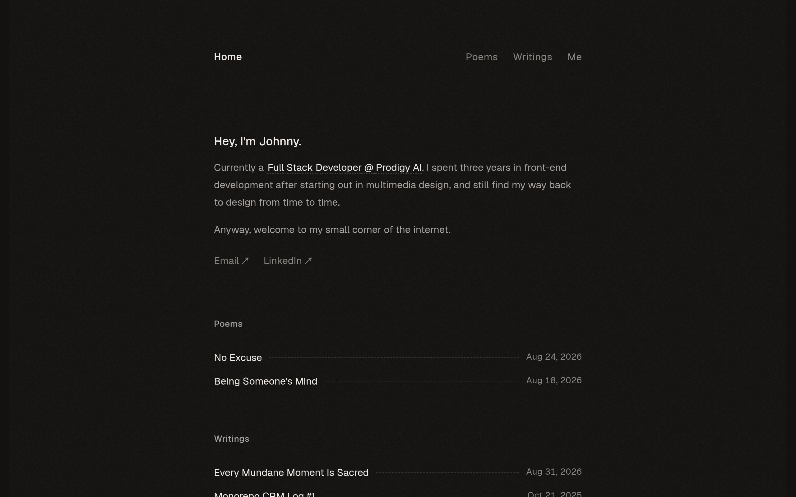

### Scroll Journey (Cinematic Visual States)

> These screenshots capture the website at different scroll depths. The design changes dramatically as you scroll — each frame shows a different cinematic state. Replicate these exact visual transitions.

#### 0% — Hero / Above the fold

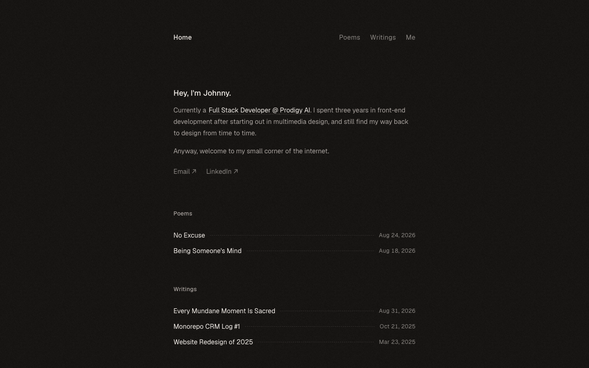

#### 17% — Mid-page at 17% scroll

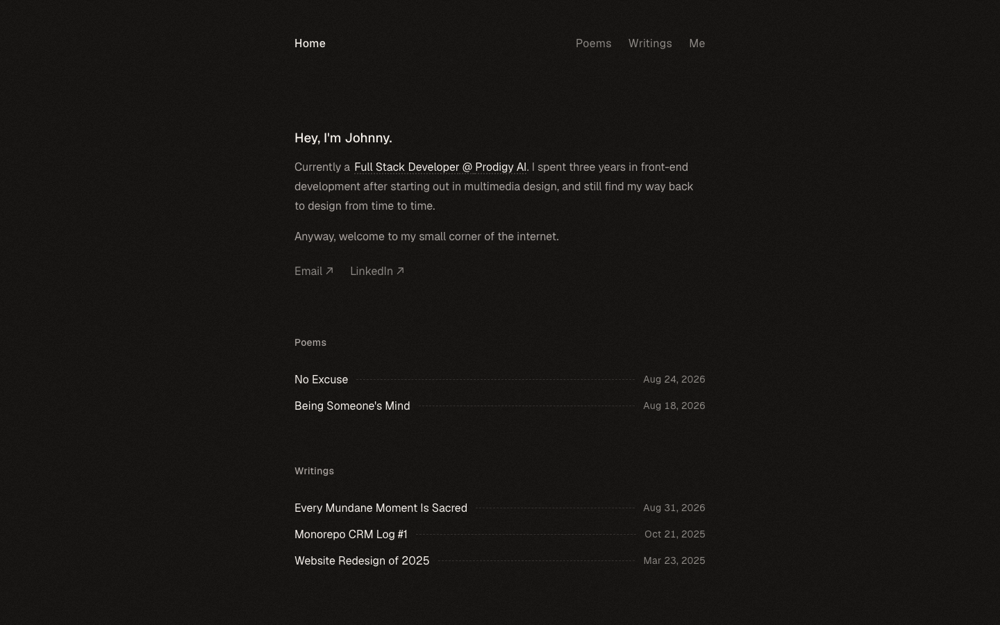

#### 33% — Mid-page at 33% scroll

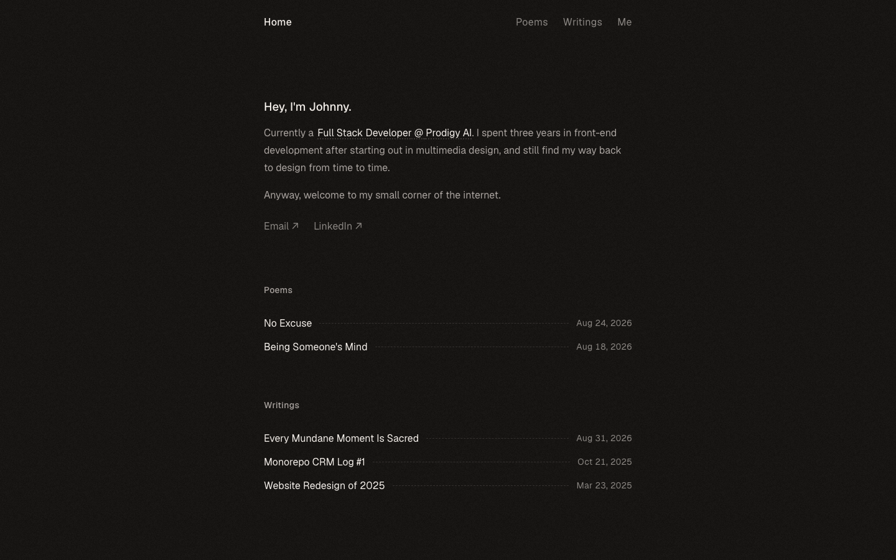

#### 50% — Mid-page at 50% scroll

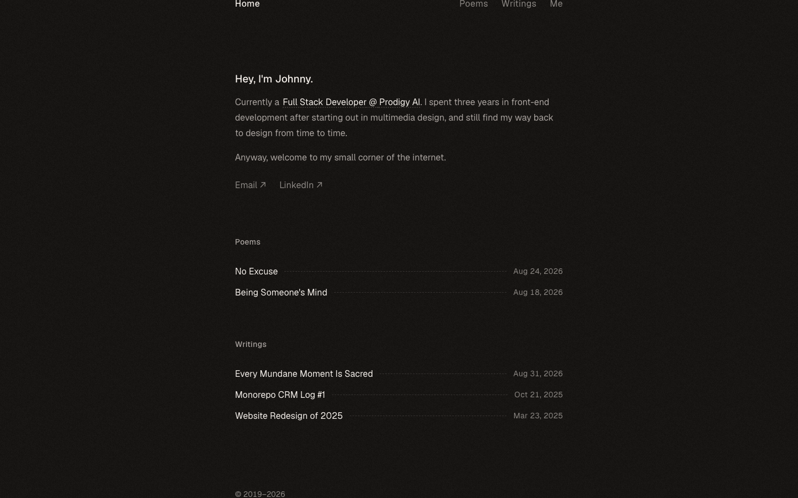

#### 67% — Mid-page at 67% scroll

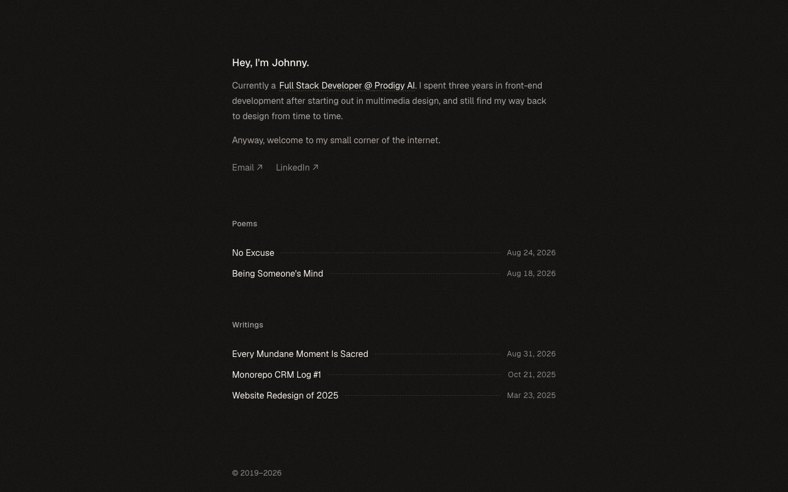

#### 83% — Mid-page at 83% scroll

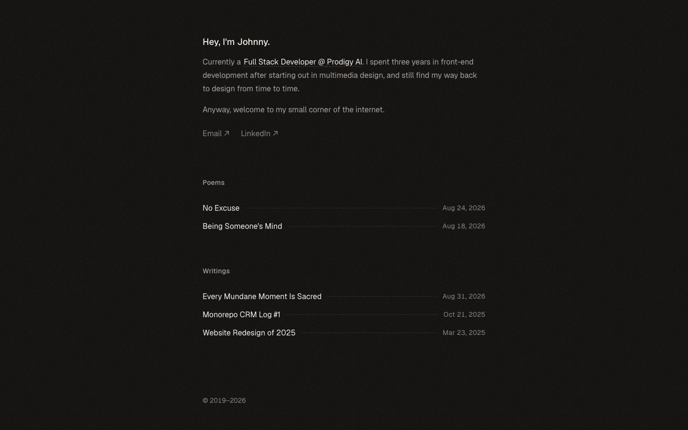

#### 100% — Footer / End of page

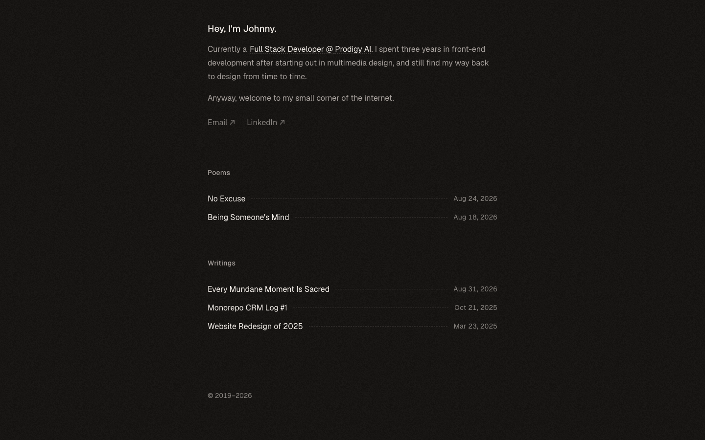

> Read `references/DESIGN.md` for full token details. Read `references/ANIMATIONS.md` for motion specs. Read `references/LAYOUT.md` for layout structure. Read `references/COMPONENTS.md` for component patterns.

## Ultra Reference Files

This package includes extended documentation. **Read these files before implementing:**

| File | Contents |
|------|----------|
| `references/DESIGN.md` | Full design system tokens, colors, typography, spacing |
| `references/VISUAL_GUIDE.md` | **START HERE** — Master visual guide with all screenshots embedded |
| `references/ANIMATIONS.md` | CSS keyframes, scroll triggers, motion library stack, video specs |
| `references/LAYOUT.md` | Flex/grid containers, page structure, spacing relationships |
| `references/COMPONENTS.md` | DOM component patterns, HTML structure, class fingerprints |
| `references/INTERACTIONS.md` | Hover/focus states with before/after style diffs |
| `screens/scroll/` | 7 scroll journey screenshots showing cinematic states |

### Animation Stack Detected

- **Web Animations API (10 active)** — animation

## Design Philosophy

- **Layered depth** — use shadow tokens to create a sense of physical layering. Each elevation level has a specific shadow.
- **Solid colors only** — no gradients anywhere. Every surface is a single flat color.
- **Single typeface** — Geist carries all text. Hierarchy comes from size, weight, and color — never font mixing.
- **compact density** — 4px base grid. Every dimension is a multiple of 4.
- **neutral palette** — the color temperature runs neutral, matching the sans-serif typography.
- **No chromatic accent** — the palette is warm monochrome. Emphasis comes from inverting it (cream surface, dark text) on small inline chips, never from a color pop.
- **Subtle motion** — transitions smooth state changes. Keep durations under 300ms, use ease-out curves.

## Color System

### Core Palette

| Role | Token | Hex | Use |
|------|-------|-----|-----|
| Background | `--color-background` | `#141210` | Page background (warm near-black) |
| Text Primary | `--color-primary` | `#f2ede8` | Headings, body text (cream) |
| Text Muted | `--color-secondary` | `#a8a29e` | Secondary copy, dates, inactive nav |
| Text Subtle | `--color-tertiary` | `#8a8682` | Lowest-emphasis text |
| Divider | `--divider` | `rgba(168, 162, 158, 0.2)` | Dashed leader lines and rules |
| Invert Surface | `--invert` | `#f2ede8` | Inline highlight chips (with `#141210` text) |

> **Corrected from the raw extraction.** The scan mislabelled this as a light theme, mapping
> `#ffffff`/`#000000` to background/text. Verified against computed styles on the live site:
> the page ground is `#141210` and primary text is `#f2ede8`. There is no chromatic accent.

### Extended Palette

The `tw-prose-*` values (`#4a5565`, `#364153`, `#d1d5dc`) that appear in the raw CSS are
Tailwind Typography plugin defaults, not brand colors — do not use them.

### CSS Variable Tokens

```css
--color-background: #141210;
--color-primary: #f2ede8;
--color-secondary: #a8a29e;
--color-background: #141210;
--color-primary: #f2ede8;
--color-secondary: #a8a29e;
--color-background: #141210;
--color-primary: #f2ede8;
--color-secondary: #a8a29e;
--color-background: #141210;
--color-primary: #f2ede8;
--color-secondary: #a8a29e;
--color-background: #141210;
--color-primary: #f2ede8;
--color-secondary: #a8a29e;
```

## Typography

### Font Stack

- **Geist** — Heading 1, Heading 2, Heading 3, Body, Caption
- **SFMono-Regular** — Code

### Font Sources

```css
@font-face {
  font-family: "Geist";
  src: url("fonts/Geist-Bold.ttf") format("truetype");
  font-weight: 700;
}
@font-face {
  font-family: "Geist";
  src: url("fonts/Geist-Regular.ttf") format("truetype");
  font-weight: 400;
}
```

### Type Scale

| Role | Family | Size | Weight |
|------|--------|------|--------|
| Heading 1 | Geist | 1.1875rem | 700 |
| Heading 2 | Geist | 1.125rem | 700 |
| Heading 3 | Geist | 1.0625rem | 700 |
| Body | Geist | 1rem | 400 |
| Caption | Geist | .9375rem | 400 |
| Code | SFMono-Regular | 14px | 400 |

### Typography Rules

- All text uses **Geist** — never add another font family
- Max 3-4 font sizes per screen
- Headings: weight 600-700, body: weight 400
- Use color and opacity for text hierarchy, not additional font sizes
- Line height: 1.5 for body, 1.2 for headings

## Spacing & Layout

### Base Grid: 4px

Every dimension (margin, padding, gap, width, height) must be a multiple of **4px**.

### Spacing Scale

`2, 4, 6, 8, 10, 12, 14, 16, 20, 24, 26, 32` px

### Spacing as Meaning

| Spacing | Use |
|---------|-----|
| 4-8px | Tight: related items (icon + label, avatar + name) |
| 12-16px | Medium: between groups within a section |
| 24-32px | Wide: between distinct sections |
| 48px+ | Vast: major page section breaks |

### Border Radius

Scale: `.25rem, .3125rem, .375rem, 4px`
Default: `.375rem`

### Breakpoints

| Name | Value |
|------|-------|
| sm | 40rem |
| md | 48rem |

Mobile-first: design for small screens, layer on responsive overrides.

## Component Patterns

### Card

```css
.card {
  background: #f2ede8;
  border-radius: .375rem;
  padding: 16px;
  box-shadow: 0 0 0 1px var(--tw-prose-kbd-shadows),0 3px 0 var(--tw-prose-kbd-shadows);
}
```

```html
<div class="card">
  <h3>Card Title</h3>
  <p>Card content goes here.</p>
</div>
```

### Button

```css
/* Primary */
.btn-primary {
  background: #f2ede8;
  color: #141210;
  border-radius: .375rem;
  padding: 8px 16px;
  font-weight: 500;
  transition: opacity 150ms ease;
}
.btn-primary:hover { opacity: 0.9; }

/* Ghost */
.btn-ghost {
  background: transparent;
  border: 1px solid rgba(168, 162, 158, 0.2);
  color: #f2ede8;
  border-radius: .375rem;
  padding: 8px 16px;
}
```

```html
<button class="btn-primary">Get Started</button>
<button class="btn-ghost">Learn More</button>
```

### Input

```css
.input {
  background: #141210;
  border: 1px solid rgba(168, 162, 158, 0.2);
  border-radius: .375rem;
  padding: 8px 12px;
  color: #f2ede8;
  font-size: 14px;
}
.input:focus { border-color: #f2ede8; outline: none; }
```

```html
<input class="input" type="text" placeholder="Search..." />
```

### Badge / Chip

```css
.badge {
  display: inline-flex;
  align-items: center;
  padding: 4px 8px;
  border-radius: 9999px;
  font-size: 12px;
  font-weight: 500;
  background: #f2ede8;
  color: #8a8682;
}
```

```html
<span class="badge">New</span>
<span class="badge">Beta</span>
```

### Modal / Dialog

```css
.modal-backdrop { background: rgba(0, 0, 0, 0.6); }
.modal {
  background: #f2ede8;
  border-radius: 4px;
  padding: 24px;
  max-width: 480px;
  width: 90vw;
  box-shadow: 0 0 0 1px var(--tw-prose-kbd-shadows),0 3px 0 var(--tw-prose-kbd-shadows);
}
```

```html
<div class="modal-backdrop">
  <div class="modal">
    <h2>Dialog Title</h2>
    <p>Dialog content.</p>
    <button class="btn-primary">Confirm</button>
    <button class="btn-ghost">Cancel</button>
  </div>
</div>
```

### Table

```css
.table { width: 100%; border-collapse: collapse; }
.table th {
  text-align: left;
  padding: 8px 12px;
  font-weight: 500;
  font-size: 12px;
  color: #8a8682;
  text-transform: uppercase;
  letter-spacing: 0.05em;
  border-bottom: 1px solid #cccccc;
}
.table td {
  padding: 12px;
  border-bottom: 1px solid #cccccc;
}
```

```html
<table class="table">
  <thead><tr><th>Name</th><th>Status</th><th>Date</th></tr></thead>
  <tbody>
    <tr><td>Item One</td><td>Active</td><td>Jan 1</td></tr>
    <tr><td>Item Two</td><td>Pending</td><td>Jan 2</td></tr>
  </tbody>
</table>
```

### Navigation

```css
.nav {
  display: flex;
  align-items: center;
  gap: 8px;
  padding: 12px 16px;
}
.nav-link {
  color: #8a8682;
  padding: 8px 12px;
  border-radius: .375rem;
  transition: color 150ms;
}
.nav-link:hover { color: #f2ede8; }
.nav-link.active { color: #f2ede8; }
```

```html
<nav class="nav">
  <a href="/" class="nav-link active">Home</a>
  <a href="/about" class="nav-link">About</a>
  <a href="/pricing" class="nav-link">Pricing</a>
  <button class="btn-primary" style="margin-left: auto">Get Started</button>
</nav>
```

### Extracted Components

These components were found in the codebase:

**Navigation** (`html`)

**Footer** (`html`)

## Page Structure

The following page sections were detected:

- **Navigation** — Top navigation bar (3 items)
- **Hero** — Hero section (detected from heading structure)
- **Footer** — Page footer with links and info

When building pages, follow this section order and structure.

## Animation & Motion

This project uses **subtle motion**. Transitions smooth state changes without calling attention.

### CSS Animations

- `slideInFromLeft`
- `ping`
- `reveal`
- `spin`

### Motion Tokens

- **Duration scale:** `.01ms`, `.3s`

### Motion Guidelines

- **Duration:** Use values from the duration scale above. Short (.01ms) for micro-interactions, long (.3s) for page transitions
- **Easing:** `ease-out` for enters, `ease-in` for exits
- **Direction:** Elements enter from bottom/right, exit to top/left
- **Reduced motion:** Always respect `prefers-reduced-motion` — disable animations when set

## Depth & Elevation

### Shadow Tokens

- Raised (cards, buttons): `0 0 0 1px var(--tw-prose-kbd-shadows),0 3px 0 var(--tw-prose-kbd-shadows)`

### Z-Index Scale

`10, 50`

Use these exact values — never invent z-index values.

## Anti-Patterns (Never Do)

- **No gradients** — solid colors only, everywhere
- **No blur effects** — no backdrop-blur, no filter: blur()
- **No zebra striping** — tables and lists use borders for separation
- **No invented colors** — every hex value must come from the palette above
- **No arbitrary spacing** — every dimension is a multiple of 4px
- **No extra fonts** — only Geist and SFMono-Regular are allowed
- **No arbitrary border-radius** — use the scale: .25rem, .3125rem, .375rem, 4px
- **No opacity for disabled states** — use muted colors instead
- **No pill shapes** — this design doesn't use rounded-full / 9999px radius

## Workflow

1. **Read** `references/DESIGN.md` before writing any UI code
2. **Pick colors** from the Color System section — never invent new ones
3. **Set typography** — Geist, SFMono-Regular only, using the type scale
4. **Build layout** on the 4px grid — check every margin, padding, gap
5. **Match components** to patterns above before creating new ones
6. **Apply elevation** — use shadow tokens
7. **Validate** — every value traces back to a design token. No magic numbers.

## Brand Spec

- **Favicon:** `/favicon.ico`
- **Site URL:** `https://johnnychai.com/`
- **Brand color:** none — warm monochrome (`#141210` / `#f2ede8`)
- **Brand typeface:** Geist

## Quick Reference

```
Background:     #141210
Surface:        #141210 (flat — no raised panels)
Text:           #f2ede8 / #a8a29e
Accent:         none (monochrome warm)
Border:         rgba(168, 162, 158, 0.2) dashed
Font:           Geist
Spacing:        4px grid
Radius:         .375rem
Components:     4 detected
```

## When to Trigger

Activate this skill when:
- Creating new components, pages, or visual elements for johnnychai
- Writing CSS, Tailwind classes, styled-components, or inline styles
- Building page layouts, templates, or responsive designs
- Reviewing UI code for design consistency
- The user mentions "johnnychai" design, style, UI, or theme
- Generating mockups, wireframes, or visual prototypes

---

# Full Reference Files

> Every output file is embedded below. Claude has full design system context from /skills alone.

## Design System Tokens (DESIGN.md)

# johnnychai DESIGN.md

> Auto-generated design system — reverse-engineered via static analysis by skillui.
> Frameworks: None detected
> Colors: 9 · Fonts: 2 · Components: 4
> Icon library: not detected · State: not detected
> Primary theme: dark · Dark mode toggle: no · Motion: subtle

## Visual Reference

**Match this design exactly** — study colors, fonts, spacing, and component shapes before writing any UI code.


---

## 1. Visual Theme & Atmosphere

This is a **dark-themed** interface with a warm, low-contrast feel. A warm near-black ground (`#141210`) carries cream text (`#f2ede8`), with a warm gray (`#a8a29e`) for secondary copy. Typography uses **Geist** throughout — a clean, modern choice that maintains consistency. Spacing follows a **4px base grid** (compact density), with scale: 2, 4, 6, 8, 10, 12, 14, 16px. The palette is monochromatic and warm — there is no chromatic accent. Emphasis comes from inverting the palette (cream background, dark text) on small inline chips. Motion is subtle — smooth transitions (150-300ms) ease state changes without drawing attention.

---

## 2. Color Palette & Roles

| Token | Hex | Role | Use |
|---|---|---|---|
| color-background | `#141210` | background | Page background (warm near-black) |
| color-primary | `#f2ede8` | text-primary | Headings and body text (cream) |
| color-secondary | `#a8a29e` | text-muted | Secondary copy, dates, inactive nav |
| color-tertiary | `#8a8682` | text-subtle | Lowest-emphasis text |
| — | `rgba(168, 162, 158, 0.2)` | divider | Dashed leader lines and rules |
| color-primary (inverted) | `#f2ede8` | invert-surface | Inline highlight chips — pairs with `#141210` text |

> Corrected from the raw extraction: the scan mislabelled this as a light theme.
> Values verified against computed styles on the live site. The `tw-prose-*` values
> are Tailwind Typography plugin defaults, not brand colors — do not use them.

### CSS Variable Tokens

```css
--tw-border-style: solid;
--color-background: #141210;
--color-primary: #f2ede8;
--color-secondary: #a8a29e;
--tw-prose-quote-borders: #e5e7eb;
--tw-prose-th-borders: #d1d5dc;
--tw-prose-td-borders: #e5e7eb;
--tw-prose-invert-quote-borders: #364153;
--tw-prose-invert-th-borders: #4a5565;
--tw-prose-invert-td-borders: #364153;
--tw-prose-quote-borders: lab(91.6229% -.159115-2.26791);
--tw-prose-th-borders: lab(85.1236% -.612259-3.7138);
--tw-prose-td-borders: lab(91.6229% -.159115-2.26791);
--tw-prose-invert-quote-borders: lab(27.1134% -.956401-12.3224);
--tw-prose-invert-th-borders: lab(35.6337% -1.58697-10.8425);
--tw-prose-invert-td-borders: lab(27.1134% -.956401-12.3224);
--tw-border-style: dashed;
--tw-border-style: solid;
--tw-border-style: solid;
--color-background: #141210;
```


---

## 3. Typography Rules

**Font Stack:**
- **Geist** — Heading 1, Heading 2, Heading 3, Body, Caption
- **SFMono-Regular** — Code

**Font Sources:**

```css
@font-face {
  font-family: "Geist";
  src: url("fonts/Geist-Bold.ttf") format("truetype");
  font-weight: 700;
}
@font-face {
  font-family: "Geist";
  src: url("fonts/Geist-Regular.ttf") format("truetype");
  font-weight: 400;
}
```

| Role | Font | Size | Weight |
|---|---|---|---|
| Heading 1 | Geist | 1.1875rem | 700 |
| Heading 2 | Geist | 1.125rem | 700 |
| Heading 3 | Geist | 1.0625rem | 700 |
| Body | Geist | 1rem | 400 |
| Caption | Geist | .9375rem | 400 |
| Code | SFMono-Regular | 14px | 400 |

**Typographic Rules:**
- Use **Geist** for all text — do not mix font families
- Maintain consistent hierarchy: no more than 3-4 font sizes per screen
- Headings use bold (600-700), body uses regular (400)
- Line height: 1.5 for body text, 1.2 for headings
- Use color and opacity for secondary hierarchy, not additional font sizes


---

## 4. Component Stylings

### Layout (1)

**Footer** — `html`

### Navigation (1)

**Navigation** — `html`

### Media (2)

**Icon** — `html`

**Map/Canvas** — `html`


---

## 5. Layout Principles

- **Base spacing unit:** 4px
- **Spacing scale:** 2, 4, 6, 8, 10, 12, 14, 16, 20, 24, 26, 32
- **Border radius:** .25rem, .3125rem, .375rem, 4px

**Spacing as Meaning:**
| Spacing | Use |
|---|---|
| 4-8px | Tight: related items within a group |
| 12-16px | Medium: between groups |
| 24-32px | Wide: between sections |
| 48px+ | Vast: major section breaks |


---

## 6. Depth & Elevation

### Raised — cards, buttons, interactive elements

- `0 0 0 1px var(--tw-prose-kbd-shadows),0 3px 0 var(--tw-prose-kbd-shadows)`

### Z-Index Scale

`10, 50`


---

## 7. Animation & Motion

This project uses **subtle motion**. Transitions smooth state changes without demanding attention.

### CSS Animations

- `@keyframes slideInFromLeft`
- `@keyframes ping`
- `@keyframes reveal`
- `@keyframes spin`

### Motion Guidelines

- Duration: 150-300ms for micro-interactions, 300-500ms for page transitions
- Easing: `ease-out` for enters, `ease-in` for exits
- Always respect `prefers-reduced-motion`


---

## 8. Do's and Don'ts

### Do's

- Use `#f2ede8` for interactive emphasis; links shift from `#a8a29e` to `#f2ede8` on hover
- Use `#141210` as the primary page background
- Use **Geist** for all UI text
- Follow the **4px** spacing grid for all margins, padding, and gaps
- Use the defined shadow tokens for elevation — see Section 6
- Use border-radius from the scale: .25rem, .3125rem, .375rem, 4px
- Reuse existing components from Section 4 before creating new ones

### Don'ts

- Don't introduce colors outside this palette — extend the design tokens first
- Don't mix font families — use Geist consistently
- Don't use arbitrary spacing values — stick to multiples of 4px
- Don't create custom box-shadow values outside the system tokens
- Don't use gradients — the design uses solid colors only
- Don't use arbitrary border-radius values — pick from the defined scale
- Don't duplicate component patterns — check Section 4 first
- Don't use backdrop-blur or blur effects

### Anti-Patterns (detected from codebase)

- No gradient backgrounds
- No blur or backdrop-blur effects
- No zebra striping on tables/lists


---

## 9. Responsive Behavior

| Name | Value | Source |
|---|---|---|
| sm | 40rem | css |
| md | 48rem | css |

**Approach:** Use `@media (min-width: ...)` queries matching the breakpoints above.


---

## 10. Agent Prompt Guide

Use these as starting points when building new UI:

### Build a Card

```
Background: #141210
Border: 1px solid var(--border)
Radius: .375rem
Padding: 16px
Font: Geist
Use shadow tokens from Section 6.
```

### Build a Button

```
Primary: bg #f2ede8, text #141210
Ghost: bg transparent, border var(--border)
Padding: 8px 16px
Radius: .375rem
Hover: opacity 0.9 or lighter shade
Focus: ring with #f2ede8
```

### Build a Page Layout

```
Background: #141210
Max-width: 1280px, centered
Grid: 4px base
Responsive: mobile-first, breakpoints from Section 9
```

### Build a Stats Card

```
Surface: #141210
Label: #a8a29e (muted, 12px, uppercase)
Value: #f2ede8 (primary, 24-32px, medium)
Status: use success/warning/danger from Section 2
```

### Build a Form

```
Input bg: #141210
Input border: 1px solid var(--border)
Focus: border-color #f2ede8
Label: #a8a29e 12px
Spacing: 16px between fields
Radius: .375rem
```

### General Component

```
1. Read DESIGN.md Sections 2-6 for tokens
2. Colors: only from palette
3. Font: Geist, type scale from Section 3
4. Spacing: 4px grid
5. Components: match patterns from Section 4
6. Elevation: shadow tokens
```

## Visual Guide — Screenshots (VISUAL_GUIDE.md)

# johnnychai — Visual Guide

> Master visual reference. Study every screenshot carefully before implementing any UI.
> Match colors, layout, typography, spacing, and motion states exactly.

**Motion Stack:** **Web Animations API (10 active)**

## Scroll Journey

The page has cinematic scroll animations. Each screenshot below shows the exact visual state at that scroll depth.
**Replicate these transitions precisely** — the design changes dramatically as you scroll.

### Hero — Above the fold

*Scroll position: 0px of 1069px total*


### 17% scroll depth

*Scroll position: 29px of 1069px total*


### 33% scroll depth

*Scroll position: 56px of 1069px total*


### 50% scroll depth

*Scroll position: 85px of 1069px total*


### 67% scroll depth

*Scroll position: 113px of 1069px total*


### 83% scroll depth

*Scroll position: 140px of 1069px total*


### Footer — End of page

*Scroll position: 169px of 1069px total*


## Full Page Screenshots

### Johnny Chai · Software Engineer

*URL: `https://johnnychai.com/`*


### Poems

*URL: `https://johnnychai.com/poems`*


### Writings · Johnny Chai

*URL: `https://johnnychai.com/writings`*


### Me · Johnny Chai

*URL: `https://johnnychai.com/me`*


### No Excuse

*URL: `https://johnnychai.com/poems/no-excuse`*


## Animations & Motion (ANIMATIONS.md)

# Animation Reference

> Cinematic motion design extracted from live DOM. Follow these specs exactly to recreate the experience.

## Motion Technology Stack

| Library | Type | Notes |
|---------|------|-------|
| **Web Animations API (10 active)** | animation |  |
| Canvas (1 elements) | 2D Canvas | 2D canvas rendering |

## Scroll Journey

The page is **1,069px** tall. Each frame below shows what the user sees at that scroll depth.

> **Use these screenshots to understand WHAT animates, WHEN it animates, and HOW it moves.**

### 0% — Top / Hero
Scroll position: 0px


### 17% — Opening Section
Scroll position: 29px


### 33% — First Feature Section
Scroll position: 56px


### 50% — Mid-Page
Scroll position: 85px


### 67% — Lower Content
Scroll position: 113px


### 83% — Near Footer
Scroll position: 140px


### 100% — Bottom / Footer
Scroll position: 169px


## CSS Keyframes (4 extracted)

### `@keyframes slideInFromLeft`

```css
@keyframes slideInFromLeft {
  0% {
    transform: translate(-100%);
  }
  100% {
    transform: translate(0px);
  }
}
```

> Transform/motion animation

### `@keyframes ping`

```css
@keyframes ping {
  75%, 100% {
    opacity: 0;
    transform: scale(2);
  }
}
```

> Fade + motion enter animation

### `@keyframes reveal`

```css
@keyframes reveal {
  0% {
    opacity: 0;
    transform: translateY(4px);
  }
  100% {
    opacity: 1;
    transform: translateY(0px);
  }
}
```

> Fade + motion enter animation

### `@keyframes spin`

```css
@keyframes spin {
  100% {
    transform: rotate(360deg);
  }
}
```

> Transform/motion animation

## Motion Tokens (CSS Variables)

### Duration Tokens

```css
--default-transition-duration: .15s;
```

### Easing Tokens

```css
--default-transition-timing-function: cubic-bezier(.4, 0, .2, 1);
```

## How to Recreate This Motion Design

### Step 1 — Install Dependencies

```bash
```

### Step 2 — Scroll-Reveal Pattern

Elements that animate into view follow this pattern:

```css
/* Initial hidden state */
.reveal {
  opacity: 0;
  transform: translateY(40px);
  transition: opacity .15s cubic-bezier(.4, 0, .2, 1),
              transform .15s cubic-bezier(.4, 0, .2, 1);
}
.reveal.visible {
  opacity: 1;
  transform: translateY(0);
}
```

### Step 3 — Key Motion Principles

- **Canvas elements (1)** — animated via requestAnimationFrame loop. Use canvas for particle effects, gradient animations, and WebGL scenes
- **Duration scale:** `.15s` — use these values, never invent new durations
- **Always add** `@media (prefers-reduced-motion: reduce) { * { animation-duration: 0.01ms !important; transition-duration: 0.01ms !important; } }`

### Step 4 — Scroll Journey Reference

Match what happens at each scroll position:

- **0%** (`0px`) → `screens/scroll/scroll-000.png`
- **17%** (`29px`) → `screens/scroll/scroll-017.png`
- **33%** (`56px`) → `screens/scroll/scroll-033.png`
- **50%** (`85px`) → `screens/scroll/scroll-050.png`
- **67%** (`113px`) → `screens/scroll/scroll-067.png`
- **83%** (`140px`) → `screens/scroll/scroll-083.png`
- **100%** (`169px`) → `screens/scroll/scroll-100.png`

## Layout & Grid (LAYOUT.md)

# Layout Reference

> Auto-extracted from live DOM. Use this to understand how the site is structured spatially.

## Spacing System

**Base grid:** 4px

**Scale:** `2, 4, 6, 8, 10, 12, 14, 16, 20, 24, 26, 32, 40, 48, 64` px

| Spacing | Semantic Use |
|---------|-------------|
| 4px | Tight — within a component |
| 8px | Medium — between sibling items |
| 16px | Wide — between sections |
| 32px | Vast — major section breaks |

## Flex Layouts

| Element | Direction | Justify | Align | Gap | Children |
|---------|-----------|---------|-------|-----|----------|
| `div.relative.z-10` | column | — | — | 80px | 3 |
| `main#main-content.flex.flex-col` | column | — | — | 80px | 3 |
| `header.flex.items-center` | row | space-between | center | — | 2 |
| `footer.flex.flex-col` | column | — | — | 24px | 1 |
| `section.flex.flex-col` | column | — | — | 64px | 2 |
| `section.flex.flex-col` | column | — | — | 24px | 2 |
| `div.flex.flex-col` | column | — | — | 16px | 3 |
| `div.flex.flex-col` | column | — | — | 24px | 2 |
| `div.flex.flex-col` | column | — | — | 24px | 2 |
| `div.flex.flex-col` | column | — | — | — | 2 |
| `div.flex.flex-col` | column | — | — | — | 3 |
| `a.group.flex` | row | — | center | 12px | 3 |
| `a.group.flex` | row | — | center | 12px | 3 |
| `a.group.flex` | row | — | center | 12px | 3 |
| `a.group.flex` | row | — | center | 12px | 3 |

## Structural Containers

### `<main>` (`main#main-content.flex.flex-col`)

```
display:          flex
flex-direction:   column
justify-content:  —
align-items:      —
gap:              80px
children:         3
```

### `<header>` (`header.flex.items-center`)

```
display:          flex
flex-direction:   row
justify-content:  space-between
align-items:      center
padding:          0px 0px 32px
children:         2
```

### `<footer>` (`footer.flex.flex-col`)

```
display:          flex
flex-direction:   column
justify-content:  —
align-items:      —
gap:              24px
padding:          32px 0px 0px
children:         1
```

### `<section>` (`section.flex.flex-col`)

```
display:          flex
flex-direction:   column
justify-content:  —
align-items:      —
gap:              64px
children:         2
```

### `<section>` (`section.flex.flex-col`)

```
display:          flex
flex-direction:   column
justify-content:  —
align-items:      —
gap:              24px
children:         2
```

## Layout Rules

- Primary layout system: **Flexbox**
- Every spacing value must be a multiple of **4px**
- Never use arbitrary margin/padding values outside the spacing scale

## Component Patterns (COMPONENTS.md)

# Component Reference

> Repeated DOM patterns detected by structural analysis. Each component appeared 3+ times.

## Detected Components

| Component | Category | Instances | Key Classes |
|-----------|----------|-----------|-------------|
| **Div** | unknown | 5× |  |
| **Flex** | unknown | 5× | `.flex`, `.flex-col`, `.gap-1` |
| **Font Normal** | unknown | 5× | `.font-normal`, `.group-hover:text-secondary`, `.leading-snug` |
| **Leading Normal** | nav-item | 5× | `.leading-normal`, `.shrink-0`, `.tabular-nums` |
| **Focus Visible:Outline None** | unknown | 3× | `.focus-visible:outline-none`, `.group` |

## Navigation Items

### Leading Normal

**Instances found:** 5

**CSS classes:** `.leading-normal` `.shrink-0` `.tabular-nums` `.text-[0.8125rem]` `.text-tertiary` `.tracking-wide`

**HTML structure:**

```html
<span class="text-[0.8125rem] md:text-[0.875rem] text-tertiary shrink-0 leading-normal tracking-wide tabular-nums sm:text-right">Aug 24, 2026</span>
```

**Base styles (from design tokens):**

```css
.leading-normal {
  padding: 4px 8px;
  cursor: pointer;
  /* active: color: #f2ede8; */
}```

## Other Components

### Div

**Instances found:** 5

**HTML structure:**

```html
<div data-reveal="true" style="animation-delay:140ms" class=""><a class="group flex flex-col gap-1 py-2.5 sm:flex-row sm:items-center sm:gap-3 md:py-2" href="/poems/no-excuse"><span class="flex items-center justify-between gap-3 sm:contents"><span class="text-[0.9375rem] md:text-[1rem] text-primary group-hover:text-secondary min-w-0 shrink leading-snug font-normal transition-colors">No Excuse</span><span aria-hidden="true" class="text-tertiary group-hover:text-secondary inline-flex shrink-0 items-center justify-center transition-colors sm:hidden"><svg xmlns="http://www.w3.org/2000/svg" fill="n
```

**Base styles (from design tokens):**

```css
.div {
  background: #f2ede8;
  padding: 4px;
}```

### Flex

**Instances found:** 5

**CSS classes:** `.flex` `.flex-col` `.gap-1` `.group` `.py-2.5`

**HTML structure:**

```html
<a class="group flex flex-col gap-1 py-2.5 sm:flex-row sm:items-center sm:gap-3 md:py-2" href="/poems/no-excuse"><span class="flex items-center justify-between gap-3 sm:contents"><span class="text-[0.9375rem] md:text-[1rem] text-primary group-hover:text-secondary min-w-0 shrink leading-snug font-normal transition-colors">No Excuse</span><span aria-hidden="true" class="text-tertiary group-hover:text-secondary inline-flex shrink-0 items-center justify-center transition-colors sm:hidden"><svg xmlns="http://www.w3.org/2000/svg" fill="none" stroke="currentColor" stroke-linecap="round" stroke-linejo
```

**Base styles (from design tokens):**

```css
.flex {
  background: #f2ede8;
  padding: 4px;
}```

### Font Normal

**Instances found:** 5

**CSS classes:** `.font-normal` `.group-hover:text-secondary` `.leading-snug` `.min-w-0` `.shrink` `.text-[0.9375rem]`

**HTML structure:**

```html
<span class="text-[0.9375rem] md:text-[1rem] text-primary group-hover:text-secondary min-w-0 shrink leading-snug font-normal transition-colors">No Excuse</span>
```

**Base styles (from design tokens):**

```css
.font-normal {
  background: #f2ede8;
  padding: 4px;
}```

### Focus Visible:Outline None

**Instances found:** 3

**CSS classes:** `.focus-visible:outline-none` `.group`

**HTML structure:**

```html
<a class="group focus-visible:outline-none" aria-current="page" href="/"><div class="text-[0.9375rem] md:text-[1rem] focus-visible:text-primary font-medium tracking-wide transition-colors text-primary">Home</div></a>
```

**Base styles (from design tokens):**

```css
.focus-visible:outline-none {
  background: #f2ede8;
  padding: 4px;
}```

## Component Rules

- Match class names exactly from the patterns above
- Each component instance must be visually identical to others of its type
- Do not add extra wrappers or change the DOM structure
- Use `#f2ede8` for all interactive/active states

## Interactions & States (INTERACTIONS.md)

# Interaction Reference

> Micro-interactions extracted from live DOM. Recreate these exactly for authentic feel.

## Coverage

| Component Type | Count | States Captured |
|----------------|-------|----------------|
| Link | 3 | default, hover, focus |

## Transition System

These transition declarations were extracted from interactive elements:

```css
transition: all;
```

Apply these to all interactive elements. Never invent new durations or easings.

## Link Interactions

### Link 1 — `Home`

**States:**

- Default: `../screens/states/link-1-default.png`
- Hover: `../screens/states/link-1-hover.png`
- Focus: `../screens/states/link-1-focus.png`

**On focus:**

```css
/* outline: rgb(0, 0, 0) none 3px → */ outline: rgb(242, 237, 232) solid 2px;
/* outline-color: rgb(0, 0, 0) → */ outline-color: rgb(242, 237, 232);
```

**Transition:** `all`

### Link 2 — `Poems`

**States:**

- Default: `../screens/states/link-2-default.png`
- Hover: `../screens/states/link-2-hover.png`
- Focus: `../screens/states/link-2-focus.png`

**On focus:**

```css
/* outline: rgb(0, 0, 0) none 3px → */ outline: rgb(242, 237, 232) solid 2px;
/* outline-color: rgb(0, 0, 0) → */ outline-color: rgb(242, 237, 232);
```

**Transition:** `all`

### Link 3 — `Writings`

**States:**

- Default: `../screens/states/link-3-default.png`
- Hover: `../screens/states/link-3-hover.png`
- Focus: `../screens/states/link-3-focus.png`

**On focus:**

```css
/* outline: rgb(0, 0, 0) none 3px → */ outline: rgb(242, 237, 232) solid 2px;
/* outline-color: rgb(0, 0, 0) → */ outline-color: rgb(242, 237, 232);
```

**Transition:** `all`

## Interaction Rules

- There is no chromatic accent; focus rings and active states use `#f2ede8` against the `#141210` ground
- Focus states use **outline** (not box-shadow) — always match the extracted focus ring
- Always respect `prefers-reduced-motion` — set all transitions to `0s` when enabled

## Design Tokens — JSON Files

### tokens/colors.json
```json
{
  "$schema": "https://design-tokens.github.io/community-group/format/",
  "core": {
    "background": {
      "value": "#141210",
      "role": "background",
      "name": "color-background"
    },
    "text-primary": {
      "value": "#f2ede8",
      "role": "text-primary",
      "name": "color-primary"
    },
    "text-muted": {
      "value": "#a8a29e",
      "role": "text-muted",
      "name": "color-secondary"
    },
    "text-subtle": {
      "value": "#8a8682",
      "role": "text-subtle",
      "name": "color-tertiary"
    },
    "surface": {
      "value": "#141210",
      "role": "surface",
      "name": "color-background"
    }
  },
  "status": {},
  "extended": {
    "invert-surface": {
      "value": "#f2ede8",
      "role": "invert-surface",
      "name": "color-primary",
      "note": "Inline highlight chips: cream background with #141210 text."
    },
    "divider": {
      "value": "rgba(168, 162, 158, 0.2)",
      "role": "divider",
      "note": "Dashed leader lines between titles and dates."
    }
  },
  "meta": {
    "theme": "dark",
    "extracted": "2026-09-11",
    "corrected": "2026-09-11",
    "correctionNote": "Raw extraction mislabelled this as a light theme (background #ffffff, text #000000) and filed the real background #141210 under 'unknown'. Roles below verified against computed styles on the live site. tw-prose-* values are Tailwind Typography defaults and were removed."
  }
}
```

### tokens/spacing.json
```json
{
  "base": {
    "value": "4px",
    "description": "Grid unit — all spacing must be multiples of this"
  },
  "unit": "px",
  "scale": {
    "xs": {
      "value": "2px",
      "px": 2
    },
    "sm": {
      "value": "4px",
      "px": 4
    },
    "md": {
      "value": "6px",
      "px": 6
    },
    "lg": {
      "value": "8px",
      "px": 8
    },
    "xl": {
      "value": "10px",
      "px": 10
    },
    "2xl": {
      "value": "12px",
      "px": 12
    },
    "3xl": {
      "value": "14px",
      "px": 14
    },
    "4xl": {
      "value": "16px",
      "px": 16
    },
    "5xl": {
      "value": "20px",
      "px": 20
    },
    "6xl": {
      "value": "24px",
      "px": 24
    }
  },
  "multipliers": {
    "1x": {
      "value": "4px",
      "raw": 4
    },
    "2x": {
      "value": "8px",
      "raw": 8
    },
    "3x": {
      "value": "12px",
      "raw": 12
    },
    "4x": {
      "value": "16px",
      "raw": 16
    },
    "5x": {
      "value": "20px",
      "raw": 20
    },
    "6x": {
      "value": "24px",
      "raw": 24
    },
    "7x": {
      "value": "28px",
      "raw": 28
    },
    "8x": {
      "value": "32px",
      "raw": 32
    },
    "9x": {
      "value": "36px",
      "raw": 36
    },
    "10x": {
      "value": "40px",
      "raw": 40
    },
    "11x": {
      "value": "44px",
      "raw": 44
    },
    "12x": {
      "value": "48px",
      "raw": 48
    },
    "13x": {
      "value": "52px",
      "raw": 52
    },
    "14x": {
      "value": "56px",
      "raw": 56
    },
    "15x": {
      "value": "60px",
      "raw": 60
    },
    "16x": {
      "value": "64px",
      "raw": 64
    }
  },
  "meta": {
    "totalValues": 15,
    "min": 2,
    "max": 64
  }
}
```

### tokens/typography.json
```json
{
  "families": [
    "Geist",
    "SFMono-Regular"
  ],
  "scale": {
    "heading-1": {
      "fontFamily": "Geist",
      "fontSize": "1.1875rem",
      "fontWeight": "700",
      "lineHeight": null,
      "source": "css"
    },
    "heading-2": {
      "fontFamily": "Geist",
      "fontSize": "1.125rem",
      "fontWeight": "700",
      "lineHeight": null,
      "source": "css"
    },
    "heading-3": {
      "fontFamily": "Geist",
      "fontSize": "1.0625rem",
      "fontWeight": "700",
      "lineHeight": null,
      "source": "css"
    },
    "body": {
      "fontFamily": "Geist",
      "fontSize": "1rem",
      "fontWeight": "400",
      "lineHeight": null,
      "source": "css"
    },
    "caption": {
      "fontFamily": "Geist",
      "fontSize": ".9375rem",
      "fontWeight": "400",
      "lineHeight": null,
      "source": "css"
    },
    "code": {
      "fontFamily": "SFMono-Regular",
      "fontSize": "14px",
      "fontWeight": "400",
      "lineHeight": null,
      "source": "css"
    }
  },
  "fontFaces": [
    {
      "family": "Geist",
      "src": "https://johnnychai.com/_next/static/immutable/media/fef07dbb0973bf53-s.00az9qtie3ho1.woff2",
      "format": "woff2",
      "weight": "100"
    },
    {
      "family": "Geist",
      "src": "https://johnnychai.com/_next/static/immutable/media/8a480f0b521d4e75-s.3j-a226dh71aj.woff2",
      "format": "woff2",
      "weight": "100"
    },
    {
      "family": "Geist",
      "src": "https://johnnychai.com/_next/static/immutable/media/53b9e256198e5412-s.2gwoz23eiro2t.woff2",
      "format": "woff2",
      "weight": "100"
    },
    {
      "family": "Geist",
      "src": "https://johnnychai.com/_next/static/immutable/media/7178b3e590c64307-s.0i3h3th1vs4m7.woff2",
      "format": "woff2",
      "weight": "100"
    },
    {
      "family": "Geist",
      "src": "https://johnnychai.com/_next/static/immutable/media/caa3a2e1cccd8315-s.p.0zr6hhvz-h9nw.woff2",
      "format": "woff2",
      "weight": "100"
    }
  ],
  "rules": {
    "maxSizesPerScreen": 4,
    "headingWeightRange": "600-700",
    "bodyWeight": 400,
    "lineHeightBody": 1.5,
    "lineHeightHeading": 1.2
  }
}
```

## Bundled Fonts (fonts/)

The following font files are bundled in the `fonts/` directory:

- `fonts/Geist-Black.ttf`
- `fonts/Geist-Bold.ttf`
- `fonts/Geist-ExtraBold.ttf`
- `fonts/Geist-ExtraLight.ttf`
- `fonts/Geist-Light.ttf`
- `fonts/Geist-Medium.ttf`
- `fonts/Geist-Regular.ttf`
- `fonts/Geist-SemiBold.ttf`
- `fonts/Geist-Thin.ttf`

Use these local font files in `@font-face` declarations instead of fetching from Google Fonts.

## Screenshots Inventory (screens/)

> Study all screenshots carefully before implementing any UI. Match every visual detail exactly.

### Scroll Journey (screens/scroll/)

*Cinematic scroll states — page visual at each scroll depth*


### Full Page Screenshots (screens/pages/)

*Full-page screenshots of each crawled URL*

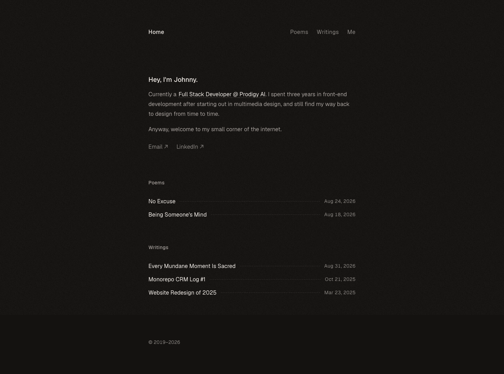

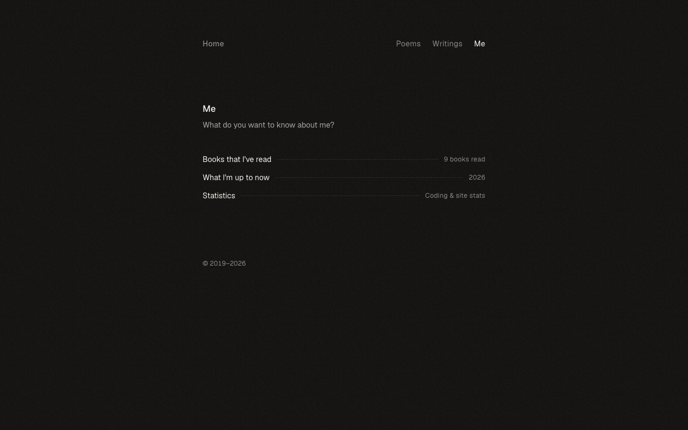

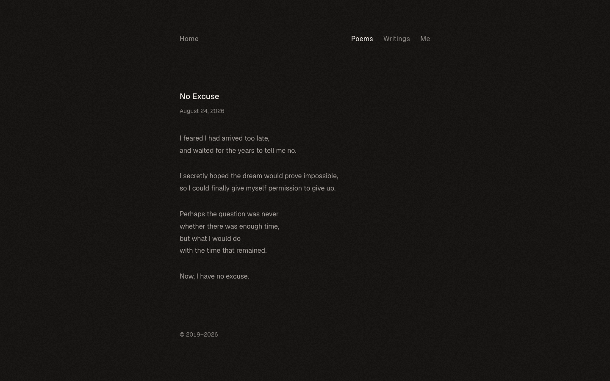

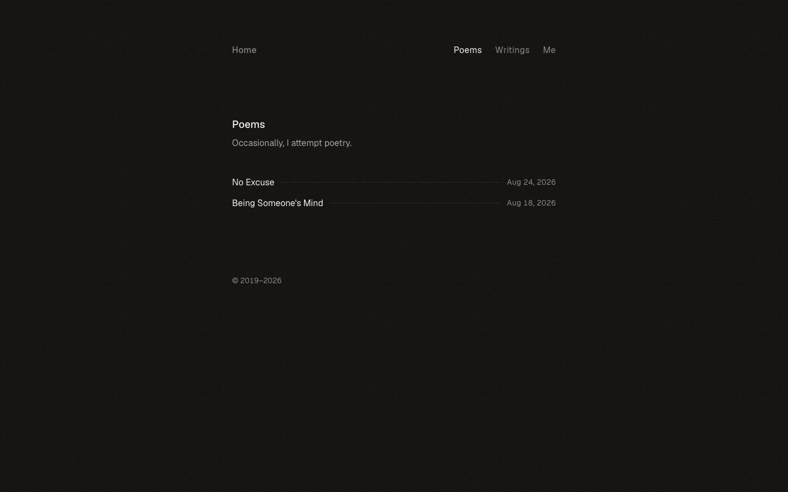

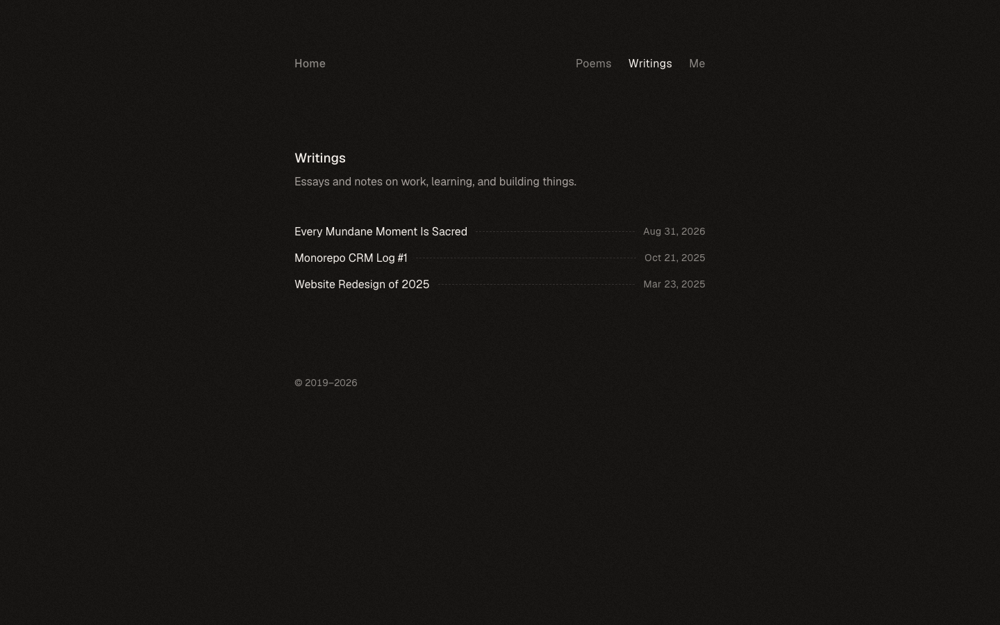

### Interaction States (screens/states/)

*Hover, focus, and active state captures*

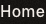

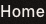

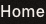

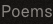

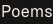

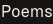

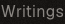

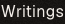

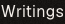

### Screenshot Index (screens/INDEX.md)

# Screenshot Index

## Scroll Journey

> Shows the cinematic state at each point of the page

| Scroll | Y Position | File |
|--------|-----------|------|
| 0% | 0px | `screens/scroll/scroll-000.png` |
| 17% | 29px | `screens/scroll/scroll-017.png` |
| 33% | 56px | `screens/scroll/scroll-033.png` |
| 50% | 85px | `screens/scroll/scroll-050.png` |
| 67% | 113px | `screens/scroll/scroll-067.png` |
| 83% | 140px | `screens/scroll/scroll-083.png` |
| 100% | 169px | `screens/scroll/scroll-100.png` |

## Pages

| Page | URL | File |
|------|-----|------|
| Johnny Chai · Software Engineer | `https://johnnychai.com/` | `screens/pages/home.png` |
| Poems | `https://johnnychai.com/poems` | `screens/pages/poems.png` |
| Writings · Johnny Chai | `https://johnnychai.com/writings` | `screens/pages/writings.png` |
| Me · Johnny Chai | `https://johnnychai.com/me` | `screens/pages/me.png` |
| No Excuse | `https://johnnychai.com/poems/no-excuse` | `screens/pages/poems-no-excuse.png` |

## Homepage Screenshots (screenshots/)


